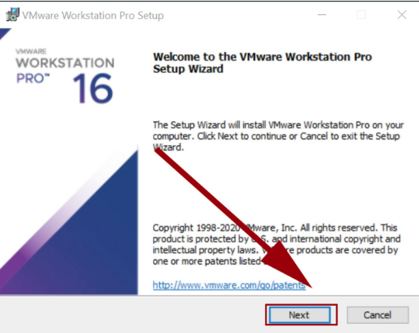
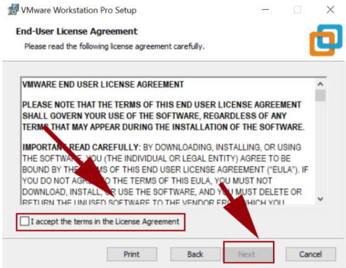
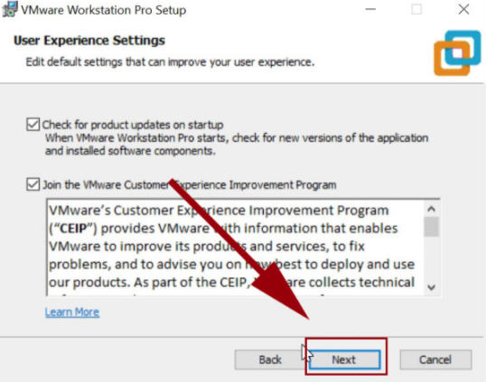
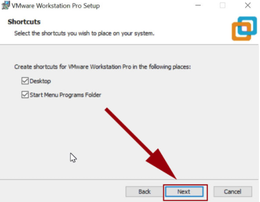
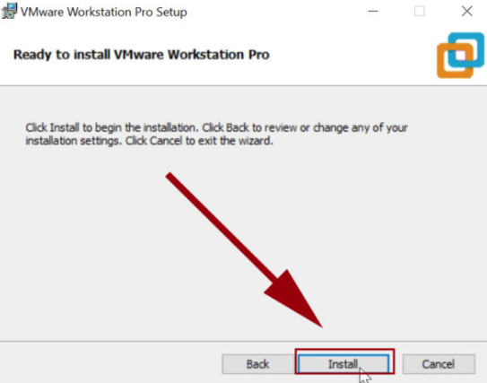
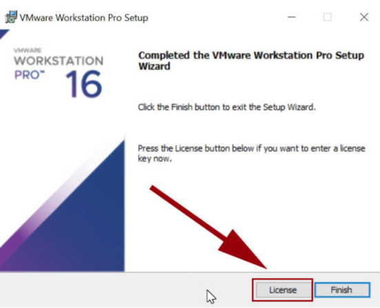

## 01 Cài Đặt VMware Workstation 16 Trên Windows Desktop

 Bước 1:

  Tải và cài đặt phần mềm VMware Workstation 16 về máy tính.

 Link tải về: https://www.vmware.com/products/workstation-pro/workstation-pro-evaluation.html

 Bước 2:

  Mở gói và cài đặt 

Bước 3:

 Nhấn vào I accept the terms in the License Agreement

Bước 4:

 Ở tùy chọn cài đặt này, bạn có thể không cần đánh dấu chọn vào dòng “Enhanced Keyboard Driver” cũng được. Tùy chọn này sẽ giúp máy ảo nhận diện bàn phím với các phím ký tự ngoài hệ chữ La-tinh (ví dụ tiếng Nhật, tiếng Hàn,…)

Bước 5:

 Bước này bạn có thể tích vào Check for product updates on startup để nhận cập nhật mới nhất từ nhà sản xuất.

Bước 6:

 Nếu bạn muốn đặt shortcut ở Desktop hoặc Start Menu Program thì bạn có thể tích vào 2 tùy chọn đó

Bước 7:

 Nhấn Install để bắt đầu cài đặt. Quá trình này sẽ diễn ra từ 2 – 3 phút tùy theo cấu hình máy.

 

 Bước 8:

  Qúa trình cài đặt hoàn tất thì sẽ xuất hiện bảng thông báo bên dưới. Và bạn tiếp tục nhập key bản quyền License để kích hoạt phần mềm. Nếu không thì bạn có thể nhấp vào Finish để dùng thử.

  

  Với các bước như trên thì bạn đã cài đặt thành công chương trình Vmware Workstation 16.

