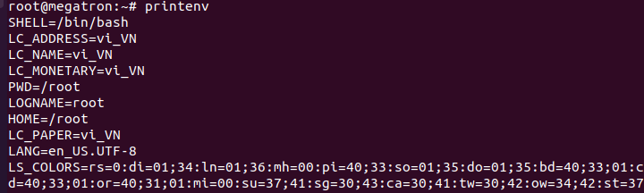
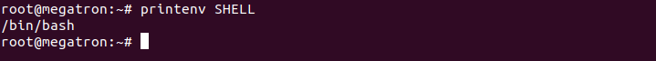

## Environmental và Environmental Variables hoạt động như thế nào?

Environmental cung cấp một phương tiện mà qua đó tiến trình shell có thể lấy hoặc thiết lập các cài đặt và chuyển những cài đặt này cho các tiến trình con của nó.

Environmental được thực hiện dưới dạng các chuỗi đại diện cho các cặp khóa-giá trị. Nếu nhiều giá trị được chuyển cùng lúc, chúng thường được phân tách bằng ký tự dấu hai chấm (:)

. Mỗi cặp thường trông giống như sau:

---
- KEY=value1:value2:...
---

Nếu giá trị chứa khoảng trắng quan trọng thì sẽ sủ dụng bằng dấu ngoặc kép " "

---
- KEY="value with spaces"
---

## Cách xem toàn bộ biến môi trường đang có

Chúng ta có thể xem danh sách tất cả các biến môi trường của mình bằng cách sử dụng lệnh "env" hoặc "printenv". Ở trạng thái mặc định, chúng sẽ hoạt động hoàn toàn giống nhau:

---
- printenv
---

Sự khác biệt giữa hai lệnh printenv và env ở trong chức năng cụ thể của chúng. Ví dụ: với printenv, bạn có thể yêu cầu giá trị của các biến riêng lẻ:

---
- printenv SHELL
---

Còn env cho phép bạn sửa đổi môi trường mà các chương trình chạy trong đó bằng cách chuyển một tập hợp các định nghĩa biến vào một lệnh như sau:

- env VAR1="value" command_to_run command_options

Điều này cho phép bạn ghi đè các giá trị hoặc đặt các giá trị mới có thể được sử dụng bởi quy trình con. Lệnh "printenv" và "env" liệt kê các biến môi trường như đã thấy ở trên. Chúng đã được xác định cho các quy trình hệ thống.

## Cách Xem Các Biến Shell

 Nếu bạn muốn xem danh sách các biến shell, bạn có thể sử dụng lệnh "set". Nhập "set" không có bất kỳ biến nào. Sẽ trả về danh sách tất cả các biến môi trường, biến shell, biến cục bộ và các hàm shell:

Các biến có thể quá nhiều. Nếu cần, bạn có thể phân trang chúng bằng lệnh:

---
- set | less
---

Chúng ta có thể làm sạch đầu ra hơn nữa bằng cách chỉ định lệnh thiết lập để thực thi trong POSIX, do đó không in các hàm shell

- (set -o posix; set)

Chúng ta có thể so sánh kết quả đầu ra này với kết quả đầu ra của lệnh "env" hoặc "printenv" để lấy danh sách chỉ các biến shell

---
- comm -23 <(set -o posix; set | sort) <(env | sort)
---

# Tạo Các biến Shell

Chúng ta sẽ bắt đầu bằng cách xác định một biến shell trong phiên hiện tại của chúng ta. Điều này rất dễ thực hiện; chúng ta chỉ cần xác định một tên và một giá trị. Chúng tôi sẽ tuân thủ quy ước giữ tất cả các chữ hoa cho tên biến và đặt nó thành một chuỗi đơn giản.

---
- TEST_VAR='Xin Chao!'
---

Bây giờ chúng ta có một biến shell. Biến này có sẵn trong phiên hiện tại của chúng tôi, nhưng sẽ không được chuyển cho các tiến trình con.

Chúng ta có thể thấy điều bằng câu lệnh "set" .

---
- set | grep TEST_VAR
---

## Tạo Các Biến Môi Trường

Chúng ta có thể làm điều này bằng cách xuất biến. Lệnh để làm như vậy được đặt tên thích hợp:

---
- export TEST_VAR
---

Chúng ta có thể kiểm tra điều này bằng lệnh printenv:

---
- printenv | grep TEST_VAR
---

Chúng ta có thể thiết lập các biến môi trường trong một bước duy nhất như sau:

---
- export NEW_VAR="Testing export"
---

## Environmental And Shell Variables Phổ Biến

SHELL:  Điều này mô tả trình bao sẽ thông dịch bất kỳ lệnh nào bạn nhập vào. Trong hầu hết các trường hợp, điều này sẽ được bash theo mặc định, nhưng có thể đặt các giá trị khác nếu bạn thích các tùy chọn khác.

TERM:  Điều này chỉ định loại thiết bị đầu cuối để mô phỏng khi chạy trình bao. Các thiết bị đầu cuối phần cứng khác nhau có thể được mô phỏng cho các yêu cầu hoạt động khác nhau. Mặc dù vậy, bạn thường sẽ không cần phải lo lắng về điều này.
USER: Người dùng đăng nhập hiện tại.

PWD:  Thư mục làm việc hiện tại.
OLDPWD: Thư mục làm việc trước đó. Điều này được giữ bởi trình bao để chuyển trở lại thư mục trước của bạn bằng cách chạy cd 

LS_COLORS:   Điều này xác định mã màu được sử dụng để tùy chọn thêm đầu ra màu vào lslệnh. Điều này được sử dụng để phân biệt các loại tệp khác nhau và cung cấp nhanh hơn thông tin cho người dùng.

MAIL: Đường dẫn đến hộp thư của người dùng hiện tại.

PATH: Danh sách các thư mục mà hệ thống sẽ kiểm tra khi tìm kiếm lệnh. Khi người dùng nhập một lệnh, hệ thống sẽ kiểm tra các thư mục theo thứ tự này để thực thi.

LANG: Cài đặt ngôn ngữ và bản địa hóa hiện tại, bao gồm cả mã hóa ký tự.

HOME: Thư mục chính của người dùng hiện tại.

_: Lệnh được thực hiện gần đây nhất trước đó.

Ngoài các biến môi trường này, một số biến shell mà bạn thường thấy là:

BASHOPTS: Danh sách các tùy chọn đã được sử dụng khi thực thi bash. Điều này có thể hữu ích để tìm hiểu xem môi trường shell có hoạt động theo cách bạn muốn hay không.

BASH_VERSION: Phiên bản của bash đang được thực thi, ở dạng con người có thể đọc được.

BASH_VERSINFO: Phiên bản của bash, ở đầu ra mà máy có thể đọc được.

COLUMNS: Số lượng cột rộng đang được sử dụng để vẽ đầu ra trên màn hình.

DIRSTACK: Ngăn xếp các thư mục có sẵn các lệnh pushdvà popd.

HISTFILESIZE: Số dòng lịch sử lệnh được lưu trữ vào một tệp.

HISTSIZE: Số dòng lịch sử lệnh cho phép trong bộ nhớ.
HOSTNAME: Tên máy tính tại thời điểm này.

IFS: Dấu tách trường bên trong để phân tách đầu vào trên dòng lệnh. Theo mặc định, đây là khoảng trắng.

PS1: Định nghĩa dấu nhắc lệnh chính. Điều này được sử dụng để xác định lời nhắc của bạn trông như thế nào khi bạn bắt đầu một phiên trình bao. Các PS2được sử dụng để khai báo nhắc nhở phụ để khi một lệnh kéo dài nhiều dòng.
SHELLOPTS: Các tùy chọn vỏ có thể được thiết lập với settùy chọn.

UID: UID của người dùng hiện tại.

