## Lệnh cat là gì

Lệnh cat là concatenate được dùng để hiển thị nội dung của file/tập tin ra màn hình

Lệnh "cat" ngoài chúng ta hay dùng để đọc nội dung trong file thì nó còn có thể dùng để nối 2 file khác nhau lại với nhau 

## Cách dùng

Xem nội dung file

---
- cat tên file
--

Nối file

Lệnh "cat" sẽ giúp ta nối file theo vertival (hàng dọc)

Giả sử ta có 2 file text chứa nội dung và giờ ta muống gộp nội dung 2 files vào chung 1 file

file1.txt

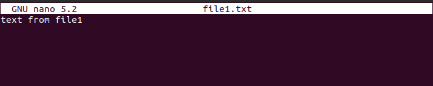

file2.txt

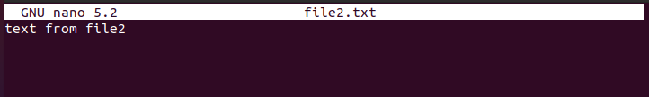

---
- cat file1.txt file2.txt > file3.txt
---

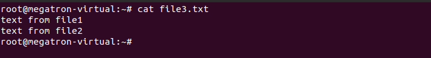

Tuy nhiên với các file chứa nhiều nội dung thì ta nên dùng lệnh "more" hoặc "less" để xem. Lệnh "cat" có nhiều option khác nhau đễ hỗ trợ ta thay đổi đôi chút text file khi tiến hành nối file:

Nếu ta muốn xem dòng kết thúc ở đâu ta sử dụng option -E (end), hệ thống sẽ thêm ký hiệu $ vào mỗi cuối dòng.

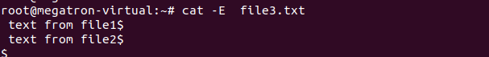

Đánh số mỗi dòng với option -n (number line),

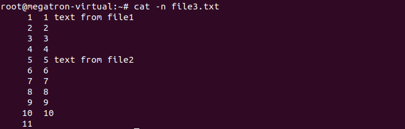

option -b (nonblank) cũng có chức năng tương tự những dòng trống sẽ không được đánh dấu.

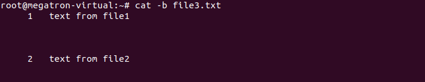

Gộp nhiều dòng trống lại thành 1 dòng trống duy nhất với option -s

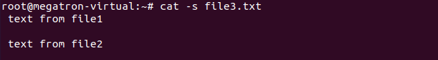

Giả sử ta muốn định dạng file name profie được đánh số mỗi dòng và có dấu cách ở mỗi dòng, ta làm như sau:

---
- cat -n /etc/profile | pr -d
---

## Lệnh JOIN dùng để làm gì

- Lệnh JOIN dùng để phép kết nối dữ liệu từ nhiều bảng lại với nhau

## Cách dùng

Lệnh "cat" giúp ta nối file theo vertival (hàng dọc), lệnh "join" thì ngược lại giúp ta nối file theo horizon (hàng ngang)

Ví dụ ta có 2 file

test1.txt

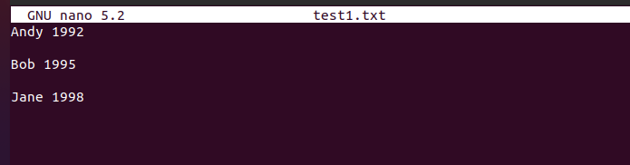

test2.txt

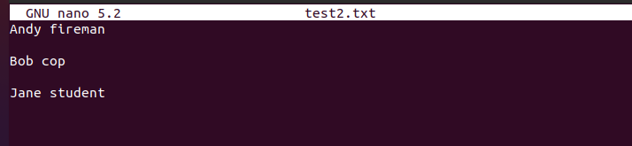

---
- join test1.txt tests2.txt > test3.txt 
---

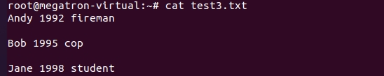

## Lệnh PASTE dùng để làm gì?

- Lệnh paste dùng để nối dòng với dòng, cách nhau bởi TAB, và không gộp chung key như join.

## Cách dùng

---
- paste test1.txt test1.txt > test3.txt
---

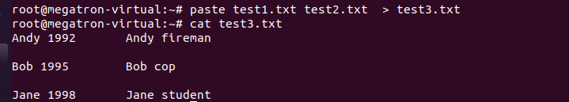

## Lệnh sort dùng để làm gì

- Lệnh "sort" được sử dụng để sắp xếp các dòng của tệp văn bản theo thứ tự tăng dần hoặc giảm dần, theo một khoá sắp xếp. Khóa sắp xếp mặc định là thứ tự của các ký tự ASCII (theo thứ tự bảng chữ cái).

## Cách sử dụng

Cú pháp của lệnh sắp xếp sort:

- sort < tuỳ chọn > < file >

---

|Cú pháp       |Chức năng|
|-|-|
|sort < file > |Sắp xếp các dòng trong tệp, theo các ký tự ở đầu mỗi dòng|
|sort -r < file> |Sắp xếp các dòng theo thứ tự ngược lại|
|

## Lệnh HEAD dùng  để làm gì

- Lệnh HEAD dùng để xem các dòng dữ liệu đầu tiên

## Cách dùng

Lệnh HEAD dùng để xem nhanh 5 dòng đầu tiên với lệnh head:

---
- cat /etc/profile | head -n 5 > test3.txt
---

## Lệnh TAIL dùng để làm gì

Lệnh TAIL dùng để xem các dòng dữ liệu cuối cùng

## Cách dùng

Xem nhanh 5 dòng cuối với lệnh tail:

---
- cat /etc/profile | tail -n 5 > test3.txt
---

## Lệnh Less dùng để làm gì

- Lệnh less dùng để xem nội dung của một tập tin 

## Cách dùng

Xem nội dung file với lệnh "less", lệnh "less" thực chất được cải tiến từ lệnh more:

---
- less /etc/securetty
---

Các phím thao tác trong khi mở file với less:

- SPACE BAR: để qua một trang khác
- ESC + V: để lùi lại một trang

- /< keyword > : để tìm kiếm theo từ khóa (case sensitive), nhấn n để di chuyển con trỏ đến kết quả tìm kiếm tiếp theo.

- g < line number >: để đi đến dòng mình muốn.
- q: để thoát khoải chương trình

## Lệnh CUT dùng để làm gì 

- Lệnh CUT dùng để trích xuất đoạn text mong muống .

## Cách Dùng

---
- cut -f FIELD_LIST filename
---

Trong đó:

FIELD_LIST là 1 danh sách các cột được hiển thị. Danh sách này chứa các số cột được phân cách bởi dấu phẩy “,”.

Ví dụ: xuất dòng 2 và dòng 3 của file test3.txt

---
 - cut -f 2,3 test3.txt
 ---

## Lệnh WC dùng để làm gì?

- Lệnh WC được sử dụng để tìm kiếm thông tin về số lượng dòng, số lượng từ, byte hoặc số lượng kí tự của 1 file

## Cách Dùng

Hiển thị nội dung kết quả khi kiểm tra file

---
- wc test3.txt

  6 12 18 test3.txt

- 6  (số lượng dòng)

- 12  (số lượng từ)

- 18 (số lượng bytes) của file.

Để đếm số lượng các dòng của 1 file hoặc 1 biến nhiều dòng, ta dùng option ‘-l‘.

---
- wc -l test3.txt
---

Để đếm số lượng từ trong 1 file hoặ 1 biến nội dung, ta dùng option ‘-w‘.

 - wc -w test3.txt

 Đếm số lượng bytes hoặc kí tự :

 - Dùng option ‘-c‘ để tính tổng byte.

- Dùng option ‘-m‘ để tính số lượng kí tự xuất hiện trong file text.

- Thường ‘-c‘ = ‘-w‘ , do 1 kí tự sẽ bằng 1 byte.

---
- wc -c test3.txt

- wc -m test3.txt

---

Để hiển thị dòng text của file có độ dài lớn nhất là bao nhiêu (số lượng bytes), ta dùng option ‘-L‘.

---
- wc -L ctest3.txt
---

## Lệnh uniq dùng để làm gì?

- Lệnh "uniq" dùng để bỏ các dòng liên tiếp trùng lặp trong một tệp văn bản rất hữu ích để đơn giản hóa hiển thị văn bản.

## Cách dùng 

Để xóa các mục trùng lặp khỏi nhiều tệp cùng một lúc, hãy sử dụng lệnh sau:

- sort file1 file2 | uniq > file3

Hoặc

- sort -u file1 file2 > file3

Để đếm số lượng mục trùng lặp, sử dụng lệnh sau:

- uniq -c filename

## Lệnh split dùng để làm gì?

- Lệnh split sử dụng để chia (hoặc tách) một tệp thành các phân đoạn có kích thước bằng nhau để xem và thao tác dễ dàng hơn và thường chỉ được sử dụng trên các tệp tương đối lớn.

## Cách Dùng

Theo mặc định, lệnh split tệp thành các phân đoạn 1000 dòng. Tệp gốc không thay đổi và một tập hợp các tệp mới có cùng tên cộng với tiền tố được thêm vào được tạo. Theo mặc định,tiền tố x được thêm vào. Để chia một tập tin thành các phân đoạn, sử dụng lệnh split infile.

---
- split tên file cần chia tách
---

## Lệnh nl dùng để làm gì?

- Lệnh nl dùng để xuất ra số dòng trong 1 file.

## Cách dùng

---
- nl tên file
---

## Lệnh tar dùng để làm gì?

Lệnh Tar là lệnh được sử dụng rộng rãi nhất trong Unix và Linux giống như hệ điều hành để tạo kho lưu trữ nhiều tệp và thư mục thành một tệp lưu trữ duy nhất và tệp lưu trữ đó có thể được nén thêm bằng cách sử dụng  kỹ thuật gzip và bzip2 .

## Cách dùng

Cú pháp của lệnh tar:

---
- tar < options > < files >
---

Nén thư mục bằng lệnh tar
Giả sử có thư mục /home/test, lệnh tar dùng để nén thư mục này

---
- tar –cvf test.tar /home/test
---
Trong trường hợp này, option có ý nghĩa như sau:

---
- -c: tạo file tar

- -v: hiển thị quá trình thực hiện

- -f: tên file tar được tạo ra
---

Nếu muốn nén file bằng gzip, chúng ta có thể sử dụng option z như sau:

---
- tar –cvzf test.tar /home/test
---

Dùng lệnh "tar" để giải nén file này trong thư mục hiện hành ta làm như sau:

tar –xvf test.tar

Trong trường hợp giải nén file "tar" tới thư mục được chỉ định:

---
- tar –xvf test.tar –C /home/name/test1/
---

---
Hoặc dùng “tar –zxvf” để giải nén file *.tar.gz.

Hoặc dùng “tar –jxvf” để giải nén file *.tar.bz2.

---

Chỉ giải nén những file .c trong file test.tar này ta làm như sau:

---
- tar –xvf test.tar –-wildcard ‘*.c’
---

Tương tự với *.tar.gz và *.tar.bz2:

---
- tar –zxvf test.tar.gz –-wildcard ‘*.c’

- tar –jxvf test.tar.b2z –-wildcard ‘*.c’
---

chỉ giải nén file1 và file2 trong file test.tar ta làm như sau:

---
- tar –xvf test.tar “file1” “file2”
---
Tương tự với *.tar.gz và *.tar.bz2:

---
- tar –zxvf test.tar.gz “file1” “file2”

- tar –jxvf test.tar.b2z “file1” “file2”
---

Để hiển thị các file, thư mục trong file “test.tar”, ta thực hiện lệnh sau:

---
- tar –tvf test.tar
---

Lệnh này cũng có thể sử dụng với *.tar.gz và *.tar.bz2:

---
tar –tvf test.tar.gz

tar –tvf test.tar.b2z

---

