## LệnhPS (Process Status)

Ps là là một tiện ích của Unix/Linux dùng để xem thông tin của các tiến trình đang chạy trong hệ thống. Đây có thể nói là một tiện ích quan trọng giúp bạn hiểu chuyện gì đang diễn ra trên hệ thống của bạn.

Tiện ích ps sẽ đọc thông tin tiến trình từ một file ảo nằm trong thư mục /proc. Nó sẽ cung cấp một số tuỳ chọn để cho bạn dễ dàng xem thông tin của các tiến trình. 

## Cách sử dụng (Ps)

 Hiển thị mọi tiến trình đang hoạt động trên hệ thống Linux ở định dạng chung (Unix / Linux).

---
- ps -A

Hoặc

- ps -e
---
Ví Dụ

---
- ps
---

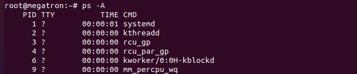

Trong bảng này, ta sẽ thấy các thông tin sau:

___
|Mục|Ý nghĩa|
|-|-|
|PID|Id của tiến trình|
|TTY|Thông tin terminal mà người dùng đăng nhập|
|TIME|Lượng CPU tính bằng phút giây mà tiến trình đó chạy|
|CMD|Câu lệnh để thực hiện process đó|

---

Lưu ý: Một số tiến trình ghi TIME là 00:00:00 (như trong ví dụ) thì các tiến trình đó không sử dụng bất cứ thời gian CPU nào. Thường đó sẽ là tiến trình cha (Parent process), các tiến trình con sẽ sử dụng nó để thực thi.

---

01: Xem thông tin đầy đủ của tiến trình

Theo cú pháp tiêu chuẩn:

---
- ps -ef
---

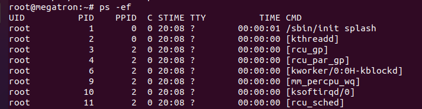

---
- ps -eF
---

---
- ps -ely
---

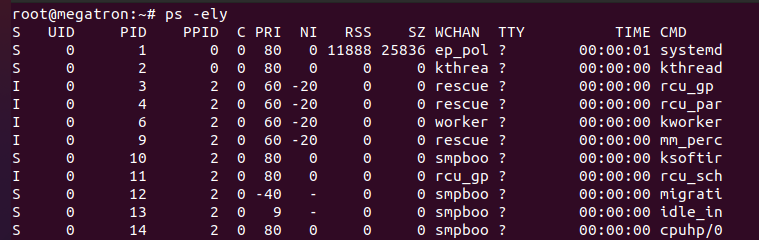

02: Theo cú pháp BSD:

---
- ps ax
---
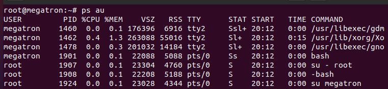

---
- ps aux
---

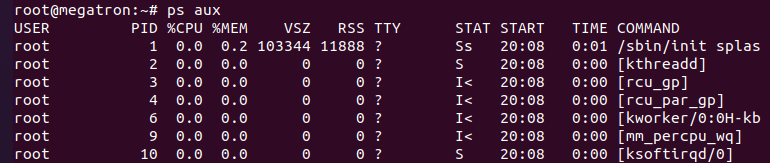

03: In các tiến trình theo dạng phân cấp.

---
- ps -ejH
---

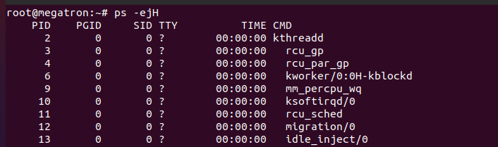

---
ps axjf

---

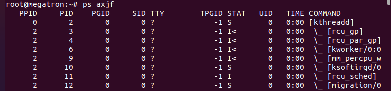

04: Hiển thị thông tin về luồng (Thread)

---
- ps -eLf
---

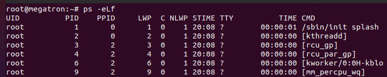

---
- ps axms
---

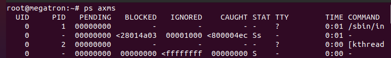

05: Xem thông tin tiến trình thuộc nhóm người dùng nhất định.

---
- ps -fG (tên user)
---

06: In ra thông tin tiến trình chạy dưới quyền root.

---
- ps -U root -u root u
---

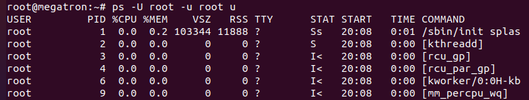

07: In ra thông tin theo một số trường cụ thể.

Ngoài những thông tin có sẵn của các option (tuỳ chọn), ta có thể thêm một số trường thông tin khác để đưa ra ngoài bằng tuỳ chọn -o.

Ví dụ, ta muốn xem thông tin pid, ppid, cmd, %mem, %cpu của tất cả các tiến trình đang chạy bằng lệnh:

---
- ps -eo pid,ppid,cmd,%mem,%cpu
---

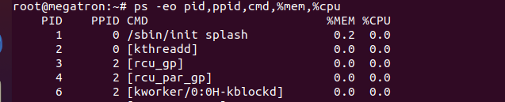

Ý nghĩa một số trường thông tin

---
|Trường|	Ý nghĩa|
|-|-|
|CMD|Câu lệnh thực thi tiến trình|
|%CPU|Lượng cpu sử dụng|
|%MEM|Lượng Ram tiêu thụ|
|PID|Mã tiến trình|
|PPID|	Mã của tiến trình cha|
|UID|mã người dùng|
|USER|Tên người dùng|
|PRI|độ ưu tiên của tiến trình|
|RSS    |Lượng bộ nhớ sử dụng thực|
|VSZ or SZ|Lượng bộ nhớ ảo sử dụng|
|S or STAT|Chứa đoạn mã code mô tả trạng thái của tiến trình|
|Start or STIME|Thời gian mà câu lệnh đó khởi động. Nhỏ hơn 24h là “HH:MM:SS”, lớn hơn là “Mmm dd”|
|TTY|Terminal liên quan tới tiến trình|

08:  Kiểm tra thời gian thực hiện của một tiến trình.

---
- ps -eo comm, etime, user | grep tên tiến trình
---

09: Tìm PID của tiến trình hoặc ứng dụng không phản hồi.

---
- ps -A | Grep -i stress
---

