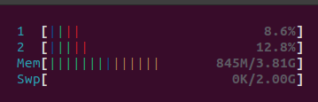
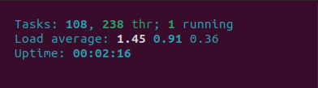
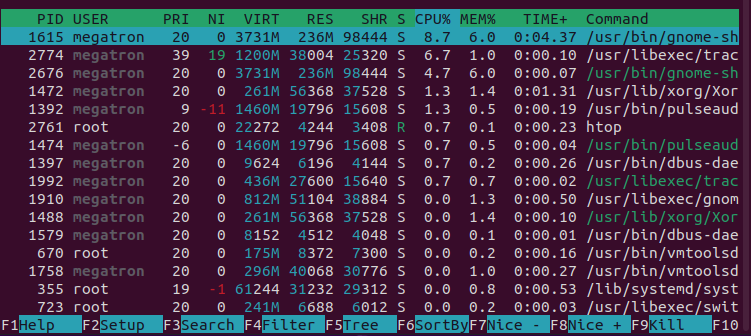

## Lệnh HTOP dùng để làm gì?

-Lệnh Htop là một tiện ích dòng lệnh cho phép người dùng theo dõi tương tác với System Processes trên Linux theo thời gian thực.

## Sử dụng lệnh htop

cài đặt htop

---
- sudo apt install htop
---

Lệnh htop được chia thành 3 phần.

Phần 1: là các thanh hiển thị mức sử dụng bộ xử lý, bộ nhớ đang sử dụng và bộ nhớ swap (RAM ảo) đang sử dụng tương ứng.

Phần 2: Là hiển thị thông tin tiêu chuẩn, chẳng hạn như tóm tắt nhiệm vụ, trung bình tải và thời gian hoạt động.

Phần 3: là phần liệt kê tất cả các tiến trình đang chạy.

---
|Tên|Mô Tả|
|-|-|
|PID|ID tiến trình|
|USER|Tên người dùng của chủ sở hữu quy trình (hoặc ID người dùng nếu tên không thể được xác định)|
|PRI|Mức ưu tiên nội bộ của kernel cho tiến trình|
|NI|Nice value của một tiến trình - từ mức ưu tiên thấp, 19 đến mức ưu tiên cao, -20|
|VIRT|Tổng dung lượng của chương trình trong bộ nhớ|
|RES|Resident Set Size (bộ nhớ mà tiến trình sử dụng)|
|SHR|Dung lượng của các trang chia sẻ tiến trình|
|S|Trạng thái của tiến trình (S - ngủ/không hoạt động, R - đang chạy, D - disk sleep/trạng thái Sleep của ổ đĩa, Z - zombie, T - bị treo)|
|W|Paging (cơ chế quản lí bộ nhớ cho phép các không gian địa chỉ thực cấp phát cho tiến trình nằm rải rác, không liên tục)|
|CPU%| Phần trăm CPU tiến trình hiện đang sử dụng|
|MEM%|Phần trăm bộ nhớ tiến trình hiện đang sử dụng|
|TIME+|Thời gian (tính theo giờ đồng hồ tiến trình đã dành cho thời gian hệ thống và người dùng)|
|Command|Đường dẫn đầy đủ của lệnh|

Như với hầu hết các lệnh Linux, cũng có các tùy chọn.

---
|Tên|Mô tả|
|-|-|
|–d – delay |hiển thị độ trễ giữa các bản cập nhật, tính bằng 1/10 giây|
|–C – no-color |chế độ đơn sắc|
|–h – help|hiển thị thông báo trợ giúp và thoát|
|–u – user=USERNAME|chỉ hiển thị các tiến trình của một người dùng nhất định|
|–p – pid=PID|chỉ hiển thị các PID đã cho|
|–s – sort-key COLUMN|Sắp xếp theo cột này|
|–v – version|thông tin phiên bản đầu ra và thoát|

Một số phím tắt

- Di chuyển dấu nhắc trong danh sách các tiến trình theo chiều dọc hoặc ngang bằng phím mũi tên

- Kill một tiến trình bằng cách nhấn phím F9

- Renice một tiến trình bằng cách nhấn phím F7 hoặc F8

- Liệt kê các tập tin được sử dụng bởi một tiến trình bằng cách nhấn phím I

- Chỉ hiển thị tiến trình của một người dùng bằng cách nhấn phím U

- Hiển thị các tiến trình được sắp xếp theo một cột bất kỳ bằng cách nhấn phím F6

- Hiển thị các tiến trình trong chế độ xem dạng cây bằng cách nhấn phím F5
