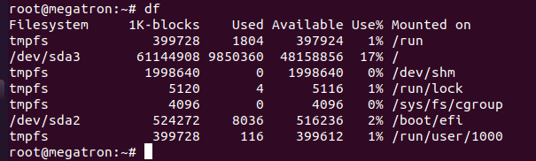
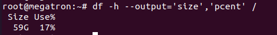

## Lệnh df

Lệnh “df” viết tắt của “disk filesystem“, nó được dùng để lấy toàn bộ thông tin về lượng ổ cứng khả dụng và lượng ổ cứng đã dùng của các file hệ thống trên linux. Cách đơn giản nhất để kiểm tra dung lượng đĩa là ta sử dụng lệnh df:

---
- df
---

---
|Tên|Mô Tả|
|-|-|
|Filesystem|Tên của hệ thống tập tin. Các hệ thống tệp không tạm thời (tmpfs)|
|1K-blocks:|Số lượng khối (block) có trong filesystem có kích thước 1Kb|
|Used|Số lượng 1K-block được sử dụng trong filesystem|
|Available|Số lượng 1K-block đang có sẵn|
|Use%|Phần trăm đĩa đã sử dụng trong filesystem|
|Mounted on|Nơi mount|

Bên cạnh đó lệnh df còn đi với một có option sau:

---
|Tên|Mô Tả|
|-|-|
|-a,--all|hiển thị tất cả các tập tin bao gồm cả tập tin không truy cập được|
|-B,--block-size=SIZE|hiển thị ích thước của khối theo KB|
|-h, --human-readable|Hiển thị kích thước theo MB|
|-H, --si|Hiển thị kích thước theo GB|
|-i, --inodes|liệt kê thông tin inode thay vì sử dụng khối |
|--output|sử dụng định dạng đầu ra được xác định bởi FIELD_LIST|

Kiểm tra kích thước và phần trăm đĩa đã sử dụng, ta gõ lệnh:

---
- df -h --output='size','pcent' /
---

## Lệnh du 

du là một công cụ dòng lệnh được cung cấp bởi Linux, nhằm báo cáo dung lượng ổ đĩa được sử dụng bởi các thư mục và file.

câu lệnh

---
- du < option > < path|file >

hoặc 

- du < option > < path1 > < path2 > < path3 > 
---

Ví dụ để kiểm tra kích thước của một file .bashrc

---
- du ~/.bashrc
---

Mặc định kích thước hiển thị là kilobytes, tuy nhiên có thể thay đổi sang định dạng size khác với việc sử dụng tùy chọn BM.

---
- du -BM ~/.bashrc
---

Kiểm tra dung lượng đĩa đã sử dụng cho thư mục

Có thể kiểm tra dung lượng đĩa được sử dụng cho thư mục bằng lệnh du với tên đường dẫn cụ thể

---
- du -shc /home
---

|tùy chọn|mô tả|
|-|-|
|-s|dùng để tóm tắt, nó sẽ hiển thị tổng số đường dẫn được cung cấp thay vì hiển thị danh sách tất cả các tệp và thư mục.|
|-h|để con người có thể đọc được, nó sẽ hiển thị kết quả với các đơn vị|
|-c|đối với tổng số lớn, nếu bạn chỉ định nhiều đường dẫn, nó sẽ tổng hợp chúng để tạo ra tổng số lớn cho chúng.|

