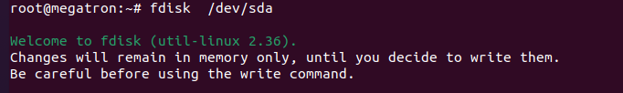
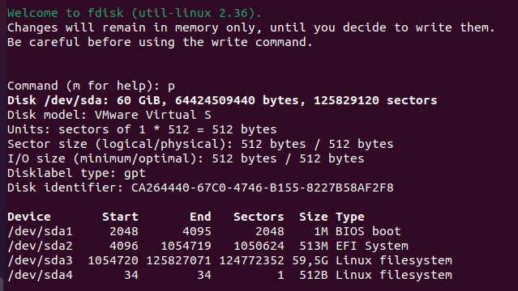
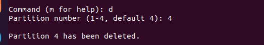
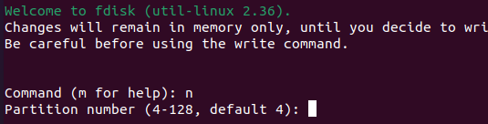
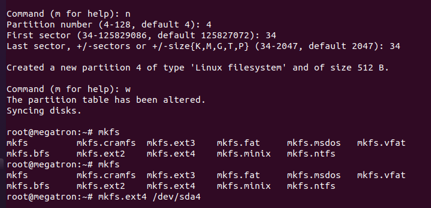

fdisk là tiện ích quản lý phân vùng đĩa cứng trên Linux. Sử dụng fdisk, bạn có thể xem, tạo, thay đổi kích thước, xóa, sao chép và di chuyển các phân vùng.

fdisk cho phép tạo tối đa bốn phân vùng chính được Linux cho phép với mỗi phân vùng yêu cầu kích thước tối thiểu 40mb.

Xem tất cả các phân vùng đĩa hiện có

---
- fdisk -l
---

Xem phân vùng trên một đĩa cụ thể

---
- fdisk -l /dev/tên ở đĩa cần xem
---

Xem tất cả các thao tác với lệnh fdisk

---
- man fdisk
---

Tạo phân vùng mới

ví dụ 

tạo một phân mới 

---
- fdisk /dev/sda
---

ở đây bấm "n" là tạo thêm một phân vùng mới. hoặc có thể bấm "m" để xem hướng dẫn

Sử dụng lệnh “p” để xem danh sách bảng phân vùng.

Để xóa một phân vùng, sử dụng lệnh “d“

ví dụ ở đây là xóa phân vùng số 4

bấm [n] để tạo phân vùng mới

Partition number: Từ 4 => 128, nó sẽ tạo phân vùng là /dev/sdb1 => dev/sdb128

First sector: Vị trí bắt đầu trên ổ đĩa.

Last sector: Vị trí cuối cùng trên ổ đĩa, hoặc thiết lập kích thước dùng lượng +size(K,M,G,T,P).

Để lưu các thông tin phân vùng chúng ta bấm phím [w] để ghi vào ổ đĩa và thoát khỏi chế độ command của lệnh fdisk

khi tạo xong ta cần định dạnh phân vùng ổ cứng bằng lệnh mkfs

---
- mkfs.định dạng phân vùng /dev/ổ đĩa vừa tạo
---

---
- mkfs.ext4 /dev/sda4
---

