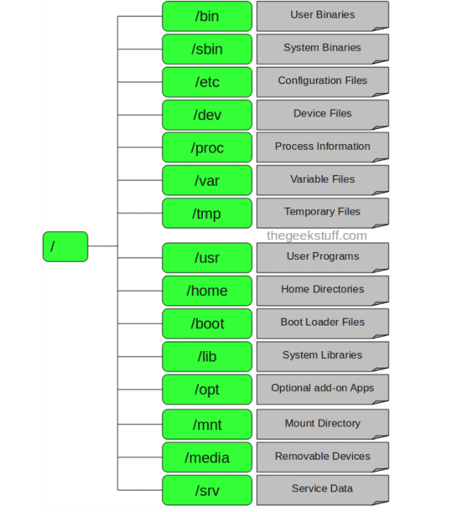

File system được dùng để quản lý cách dữ liệu được đọc và lưu trên thiết bị.

File system cho phép người dùng truy cập nhanh chóng và an toàn khi cần thiết.

---
|tên thư mục|mô tả| 
|-|-|
|/|Thư mục gốc.Chỉ có Root user mới có quyền viết dưới thư mục này Lưu ý rằng /root là thư mục gốc của Root user.|
|/bin|Là nơi chứa các lệnh thiết yếu cho người sử dụng như : cat, chmod, cp|
|/sbin|Là nơi chứa các file thực thi các lệnh cho người quản trị hệ thống|
|/etc|Chứa cấu hình các tập tin cấu hình của hệ thống, các tập tin lệnh để khởi động các dịch vụ của hệ thống……|
|/dev|Chứa các tập tin để nhận biết cho các thiết bị và thiết bị ngoại vi của hệ thống|
| /proc|chứa thông tin về các tiến trình đang chạy|
|/var|dữ liệu thay đổi, thư mục spool (máy in), tập tin nhật ký (logs), thư mục chia sẻ và không chia sẻ|
|/tmp|Thư mục chứa các tập tin tạm thời được tạo bởi hệ thống và user. Các tập tin tạo thư mục này được xóa khi hệ thống được khởi động lại (reboot)|
|/usr|Chứa các ứng dụng, thư viện, tài liệu và mã nguồn các chương trình thứ cấp.|
|/usr/bin|chứa các tập tin của các ứng dụng chính đã được cài đặt cho user|
|/usr/sbin|có chứa các tập tin ứng dụng cho Admin hệ thống|
|/usr/lib|chứa thư viện /usr/bin và /usr/sbin.|
|/usr/local|chứa các chương trình user mà bạn cài đặt từ nguồn.|
|/home|Thư mục chính lưu trữ các tập tin cá nhân của tất cả user.|
|/boot|Chứa các tập tin cấu hình cho quá trình khởi động hệ thống.|
|/lib|Chứa các file thư viện hỗ trợ các thư mục nằm dưới /bin và /sbin.|
|/opt|Chứa các ứng dụng add-on từ các nhà cung cấp.|
|/mnt|Gắn kết các thư mục hệ thống tạm thời (thư mục Temporary) nơi Sysadmins có thể gắn kết các file hệ thống.|
|/media|Gắn kết các thư mục Temporary (thư mục tạm thời) được hệ thống tạo ra khi một thiết bị lưu động (removable media) được cắm vào như đĩa CDs, máy ảnh kỹ thuật số...|
|/srv|Chứa các service của máy chủ cụ thể liên quan đến dữ liệu.|