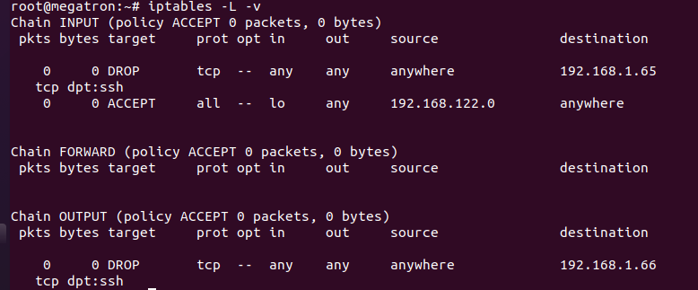

IPtables là ứng dụng tường lửa miễn phí trong Linux, cho phép thiết lập các quy tắc riêng để kiểm soát truy cập, tăng tính bảo mật. Khi sử dụng máy chủ, tường lửa là một trong những công cụ quan trọng giúp bạn ngăn chặn các truy cập không hợp lệ. Đối với các bản phân phối Linux như Ubuntu, Fedora, CentOS… bạn có thể tìm thấy công cụ tường lửa tích hợp sẵn IPtables

## Các bảng trong IPtables

Table được IPtables sử dụng để định nghĩa các rules(quy tắc) dành cho các gói tin. Trong đó, có các Table sau. 

|tên bảng|mô tả|
|-|-|
|Filter Table|Là một trong những tables được IPtables sử dụng nhiều nhất, Filter Table sẽ quyết định việc một gói tin có được đi đến đích dự kiến hay từ chối yêu cầu của gói tin.|
|NAT Table|Để dùng các rules về NAT(Network Address Translation), NAT Table sẽ có trách nhiệm chỉnh sửa source(IP nguồn) hoặc destination(IP đích) của gói tin khi thực hiện cơ chế NAT.|
|Mangle Table|Cho phép chỉnh sửa header của gói tin, giá trị của các trường TTL, MTU, Type of Service.|
|Raw Table|là một stateful firewall với các gói tin được kiểm tra liên quan đến trạng thái(state)|
|Security Table|Một vài kernel có thể hỗ trợ thêm Security Table, được dùng bởi SELinux để thiết lập các chính sách bảo mật.|

## Target

Target có thể được hiểu là hành động dành cho các gói tin khi gói tin thỏa mãn các rules đặt ra.

|tên|mô tả|
|-|-|
|ACCEPT|chấp nhận và cho phép gói tin đi vào hệ thống.|
|DROP| loại gói tin, không có gói tin trả lời|
|REJECT|loại gói tin những có trả lời table gói tin khác. Ví dụ: trả lời table 1 gói tin “connection reset” đối với gói TCP hoặc “destination host unreachable” đối với gói UDP và ICMP|
|LOG|chấp nhận gói tin nhưng có ghi lại log.|

## Chains

Chains được tạo ra với một số lượng nhất định ứng với mỗi Table, giúp lọc gói tin tại các điểm khác nhau.

|tên|mô tả|
|-|-|
|PREROUTING|tồn tại trong Nat Table, Mangle Table và Raw Table, các rules trong chain sẽ được thực thi ngay khi gói tin vào đến giao diện mạng (Network Interface).|
|INPUT|chỉ có ở Mangle Table và Nat Table với các rules được thực thi ngay trước khi gói tin gặp tiến trình.|
|OUTPUT|tồn tại ở Raw Table, Mangle Table và Filter Table, có các rules được thực thi sau khi gói tin được tiến trình tạo ra.|
|FORWARD|tồn tại ở Manle Table và Filter Table, có các rules được thực thi cho các gói tin được định tuyến qua host hiện tại.|
|POSTROUTING|chỉ tồn tại ở Manle Table và Nat Table với các rules được thực thi khi gói tin rời giao diện mạng.|

## Thao tác với Iptable

Để kiểm tra các rule hiện có trong iptables ta dùng lệnh sau

---
- iptables -L –v
---

Ý nghĩa của từng cột

|tên|mô tả|
|-|-|
|TARGET|hành động sẽ thực thi.|
|PROT|viết tắt của Protocol, là các giao thức sẽ được áp dụng để thực thi quy tắc này. Ở đây chúng ta có 3 lựa chọn là all, tcp hoặc udp. Các ứng dụng như SSH, FTP, sFTP,..đều sử dụng giao thức TCP.|
|IN|chỉ ra rule sẽ áp dụng cho các gói tin đi vào từ interface nào, ví dụ lo, eth0, eth1 hoặc any là áp dụng cho tất cả interface.|
|OUT|tương tự  IN, chỉ ra rule sẽ áp dụng cho các gói tin đi ra từ interface nào.|
|DESTINATION|địa chỉ của lượt truy cập được phép áp dụng quy tắc|
|ACCEPT|chấp nhận gói tin của kết nối hiện tại|
|DROP|loại bỏ tất cả các gói tin nếu không khớp với các rule ở trên.|

## Các tùy Chọn Kèm Theo Iptables

|ký hiệu|Môt Tả|
|-|-|
|-t |chỉ định tên table ví dụ -t filter, -t nat|
|-p |chỉ đinh loại giao thức|
|-i|chỉ định card mạng vào|
|-o|chỉ định card mạng ra|
|-s|chỉ định địa chỉ IP nguồn|
|-d| chỉ định địa chỉ IP đích|
|--sport |chỉ định cổng nguồn:|
|--dport|chỉ định cổng đích|
|-m|là một options để sử dụng extension của iptables ví dụ conntrack --ctstate|
|-P|Để chặn mọi packet input hoặc output|
|-A|thêm rule|
|-D|xóa rule|
|-R|thay thế rule|
|-I|chèn thêm rule|
|-N|Tạo mới|
|-X|Xóa hết các rule đã tạo chain|
|-F|Xóa các rule có trong chain|
|-Z|Reset bộ đếm packet|

