## Lệnh Rsync là gì ?

- Rsync (Remote Sync) là một công cụ dùng để sao chép và đồng bộ file/thư mục được dùng rất phổ biến. Với sự trợ giúp của rsync, bạn có thể đồng bộ dữ liệu trên local hoặc giữa các server với nhau một cách dễ dàng.

## Cách sử dụng

Để cài đặt ta dùng câu lệnh

---
- sudo apt-get install rsysnc
---

các tham só của lệnh rsync

|tên|mô tả|
|-|-|
|-v|hiển thị trạng thái kết quả|
|-r|copy dữ liệu recursively, nhưng không đảm bảo thông số của file và thư mục|
|-a|cho phép copy dữ liệu recursively, đồng thời giữ nguyên được tất cả các thông số của thư mục và file|
|-z|nén dữ liệu khi transfer|
|-h|output kết quả dễ đọc|
|--delete|xóa dữ liệu ở destination nếu source không tồn tại dữ liệu đó.|
|--exclude| loại trừ ra những dữ liệu không muốn truyền đi.|

ví dụ Copy file test sang /tmp/test/

---
- rsync -av test /tmp/test/
---

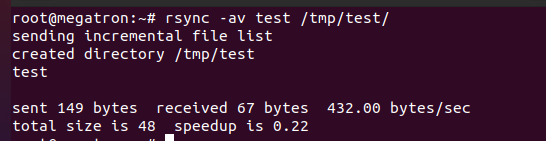

|tên|mô tả|
|-|-|
|-a|cho phép copy dữ liệu recursively, đồng thời giữ nguyên được tất cả các thông số của thư mục và file|
|-v|hiển thị trạng thái kết quả|

Ví dụ Copy file test sang máy Remote

---
- rsync -avz test  root@192.168.231.29:/home/
--

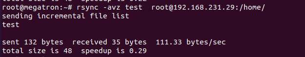

|tên|mô tả|
|-|-|
|-a|cho phép copy dữ liệu recursively, đồng thời giữ nguyên được tất cả các thông số của thư mục và file|
|-v|hiển thị trạng thái kết quả|
|-z|nén dữ liệu khi transfer|

Ví dụ Copy file test từ máy  Remote về Local

---
- rsync -avh root@192.168.231.29:/home/test /root/
---
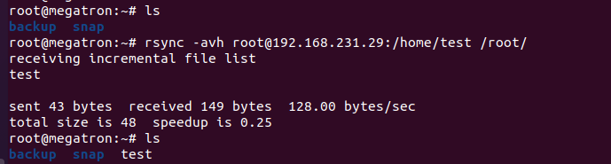

|tên|mô tả|
|-|-|
|-a|cho phép copy dữ liệu recursively, đồng thời giữ nguyên được tất cả các thông số của thư mục và file|
|-v|hiển thị trạng thái kết quả|
|-h|hiển thị kết quả dễ đọc|

## Lệnh SCP là gì 

- SCP (Secure Copy) là một công cụ dòng lệnh cho các hệ thống Linux để chuyển tập tin an toàn từ máy cục bộ sang máy chủ từ xa hoặc ngược lại SCP sử dụng giao thức SSH giữa các tập tin chuyển giao giữa hai hệ thống an toàn hơn FTP.

## Cách sử dụng

Chuyển tệp Local sang máy chủ Remote

Ví dụ sao chép test.txt từ máy local sang thư mục /home máy remote 

---
- scp test.txt root@192.168.231.29:/home/
---
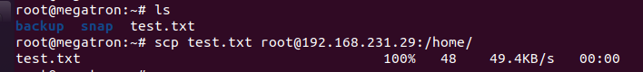

sao chép /home/test.txt từ máy remote sang thư mục /tmp máy local

---
- scp root@192.168.231.29:/home/test.txt /tmp
---

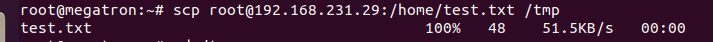

Chuyển thư mục Local sang máy chủ Remote

---
- scp -r /root/test root@192.168.231.29:/home/
---

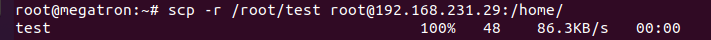

Chuyển thư mục remote sang máy chủ local

---
- scp -r  root@192.168.231.29:/home/test /tmp
---

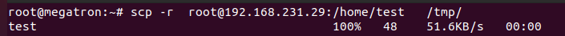

### Lệnh Rsnapshot là gì 

- Rsnapshot là một giải pháp sao lưu gọn nhẹ và cực kỳ đơn giản, nó tạo sự luân phiên backup các thư mục local hoặc điều khiển từ xa. Đây là một bản sao lưu bonus được tạo ra bằng cách sử dụng Hardlinks* để giảm không gian lưu trữ trên host. Cũng như nhiều giải pháp sao lưu khác, rsnapshot là một script được xây dựng trên nền tảng OpenSSH và Rsync – sau này được sử dụng để đồng bộ hóa nội dung thư mục mà không cần sử dụng quá nhiều băng thông. Trước đây nó được dùng để đảm bảo thông tin liên lạc được mã hóa và an toàn.

## Cách sử dụng

Để cài đặt trên máy ubuntu

---
- sudo apt-get install rsnapshot -y
---

## Cấu Hình rsnapshot

ta vào vào file rsnapshot.conf

---
- sudo vim /etc/rsnapshot.conf
---

Mở tập tin /etc/rsnapshot.conf bằng trình soạn thảo văn bản của bạn (chẳng hạn vi), nhìn vào phần đầu của snapshot_root – đây là nơi rsnapshot lưu trữ các bản sao hệ thống. Theo mặc định chúng nằm trong thư mục root, nhưng có thể thay đổi thành thư mục bạn muốn

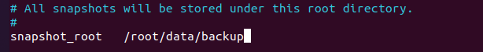

Tiếp theo chúng ta bỏ chú thích cho dòng no_create_root 1, điều này sẽ dừng việc tạo thư mục snapshot_root (có nghĩa là bạn phải tự tạo nó cho chính mình). Lợi ích là trong trường hợp bạn sao lưu vào ổ USB mà quên rằng phải kết nối nó, rsnapshot sẽ không tiến hành sao lưu để trách gây tai nạn cho máy chủ (nếu không có phân vùng chính xác).

Bởi hệ thống của chúng tôi đang chạy Linux nên sẽ bỏ chú thích tại dòng cmd_cp:

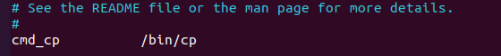

Tiếp theo bỏ chú thích tại dòng cmd_ssh và cung cấp cho nó đường dẫn chính xác tới ssh binary.

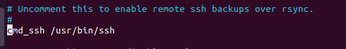

Không bỏ chú thích ở tùy chọn du, đây là công cụ nhỏ làm hiển thị kích thước mỗi ảnh chụp snapshot. Nếu bạn chỉ cần làm một du -sh * trong thư mục snapshot, nó sẽ đọc sai do các liên kết cứng.

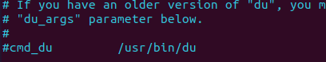

Backup Intervals,giữ nguyên giá trị mặc định. Do đó rsnapshot sẽ có 6 bản sao dự phòng theo giờ , 7 bản sao hàng ngày, 4 bản hàng tuần và 3 bản hàng tháng. 

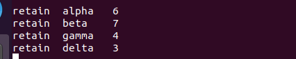

Chú ý là rsnapshot sẽ không tạo bản sao lưu rsnapshot cho đến khi alpha.5 được tạo trong snapshot_root, tương tự với weekly và monthly.

Bỏ chú thích logfile /var/log/rsnapshot.log dữ liệu sẽ được ghi vào tệp bạn chỉ định

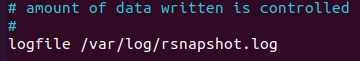

Bỏ chú thích ssh_args

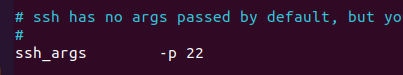

Lập một danh sách những thư mình cần sao lưu hoặc loại bỏ. (+) là thêm (-) là loại trừ.

---
- vim /root/backup/tecmint.exclude
---

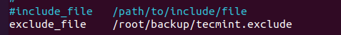

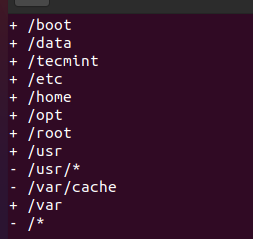

cách thư mục cần backup của cả local và server cần backup

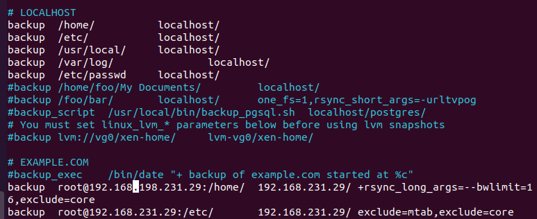

xong tất cả ta kiểm tra cấu hình bằng 

---
- rsnapshot configtest
---

kiểm tra thử  alpha

---
- rsnapshot -t alpha
---

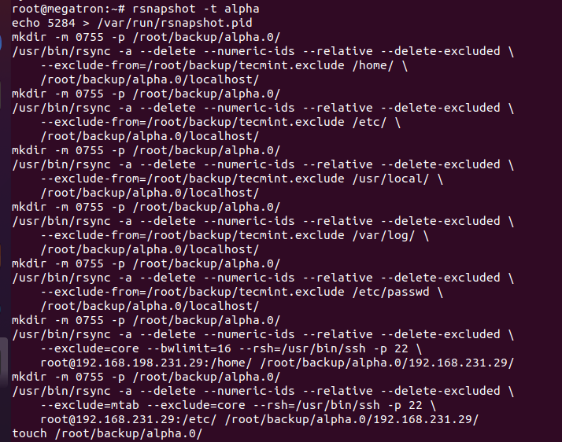

chạy alpha 

---
- rsnapshot  alpha
---

kết quả sau khi chạy xong alpha

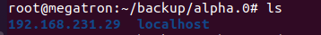
