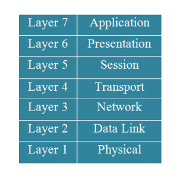
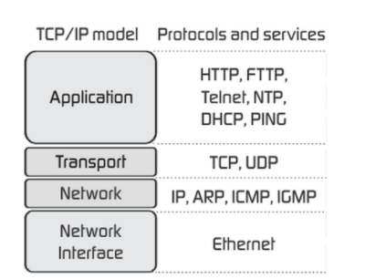

## Mô hình OSI 7 lớp 

Mô hình kết nối các hệ thống mở OSI là mô hình căn bản về các tiến trình truyền thông, thiết lập các tiêu chuẩn kiến trúc mạng ở mức Quốc tế, là cơ sở chung để các hệ thống khác nhau có thể liên kết và truyền thông được với nhau. Mô hình OSI tổ chức các giao thức truyền thông thành 7 tầng, mỗi một tầng giải quyết một phần hẹp của tiến trình truyền thông, chia tiến trình truyền thông thành nhiều tầng và trong mỗi tầng có thể có nhiều giao thức khác nhau thực hiện các nhu cầu truyền thông cụ thể.

- Application: là tầng ứng dụng gần với người sử dụng nhất là nơi cung mấp các chương trình mạng cho người sử dụng có thể tạo ta các khối dữ liệu và giao tiếp với người dùng.

- Presentation là tầng trình diễn máy tính làm nhiệm vụ truyền dữ liệu, dịch dữ liệu, nén dữ liệu và mã hóa dữ liệu được gửi xuống tần ở bên dưới 

- Session: là tầng phiên hội thoại giữa các máy tính. Session giữ nhiệm vụ là giữ,duy trì ,kết nối ,khởi tạo,hoặc hủy giữa các phiên kết nối với nhau

- Transport: là tầng vận chuyển cung cấp một phương tiện vận chuyển từ người gửi sang bên nhận. Có hai phương tiện phổ biến nhất hiện nay là phương tiện TCP và phương tiện UDP

- Network là tầng mạng là tầng để gán đại chỉ và phân biệt địa chỉ 

- Data Link: là tầng liên kết dữ liệu 

- Physical là tầng vật lý sẽ cung cấp cho chúng ta tín hiệu đường chuyền 

## Mô hình TCP/IP 4 lớp

TCP/ IP (Transmission Control Protocol/ Internet Protocol - Giao thức điều khiển truyền nhận/ Giao thức liên mạng), là một bộ giao thức trao đổi thông tin được sử dụng để truyền tải và kết nối các thiết bị trong mạng Internet. TCP/IP được phát triển để mạng được tin cậy hơn cùng với khả năng phục hồi tự động.

Tầng 4 - Tầng Ứng dụng (Application) 
Đây là lớp giao tiếp trên cùng của mô hình. Đúng với tên gọi, tầng Ứng dụng đảm nhận vai trò giao tiếp dữ liệu giữa 2 máy khác nhau thông qua các dịch vụ mạng khác nhau (duyệt web, chat, gửi email, một số giao thức trao đổi dữ liệu: SMTP, SSH, FTP,...). Dữ liệu khi đến đây sẽ được định dạng theo kiểu Byte nối Byte, cùng với đó là các thông tin định tuyến giúp xác định đường đi đúng của một gói tin.

ầng 3 - Tầng Giao vận (Transport) 

Chức năng chính của tầng 3 là xử lý vấn đề giao tiếp giữa các máy chủ trong cùng một mạng hoặc khác mạng được kết nối với nhau thông qua bộ định tuyến. Tại đây dữ liệu sẽ được phân đoạn, mỗi đoạn sẽ không bằng nhau nhưng kích thước phải nhỏ hơn 64KB. Cấu trúc đầy đủ của một Segment lúc này là Header chứa thông tin điều khiển và sau đó là dữ liệu.

Trong tầng này còn bao gồm 2 giao thức cốt lõi là TCP và UDP. Trong đó, TCP đảm bảo chất lượng gói tin nhưng tiêu tốn thời gian khá lâu để kiểm tra đầy đủ thông tin từ thứ tự dữ liệu cho đến việc kiểm soát vấn đề tắc nghẽn lưu lượng dữ liệu. Trái với điều đó, UDP cho thấy tốc độ truyền tải nhanh hơn nhưng lại không đảm bảo được chất lượng dữ liệu được gửi đi.

Tầng 2 - Tầng mạng (Internet) 
Gần giống như tầng mạng của mô hình OSI. Tại đây, nó cũng được định nghĩa là một giao thức chịu trách nhiệm truyền tải dữ liệu một cách logic trong mạng. Các phân đoạn dữ liệu sẽ được đóng gói (Packets) với kích thước mỗi gói phù hợp với mạng chuyển mạch mà nó dùng để truyền dữ liệu. Lúc này, các gói tin được chèn thêm phần Header chứa thông tin của tầng mạng và tiếp tục được chuyển đến tầng tiếp theo. Các giao thức chính trong tầng là IP, ICMP và ARP.

Tầng 1 - Tầng Vật lý (Physical) 

Là sự kết hợp giữa tầng Vật lý và tầng liên kết dữ liệu của mô hình OSI. Chịu trách nhiệm truyền dữ liệu giữa hai thiết bị trong cùng một mạng. Tại đây, các gói dữ liệu được đóng vào khung (gọi là Frame) và được định tuyến đi đến đích đã được chỉ định ban đầu.

