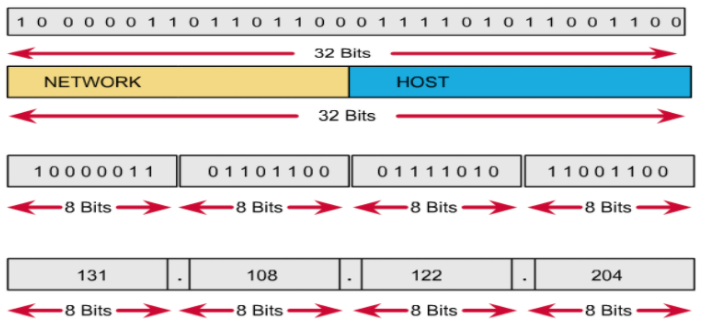
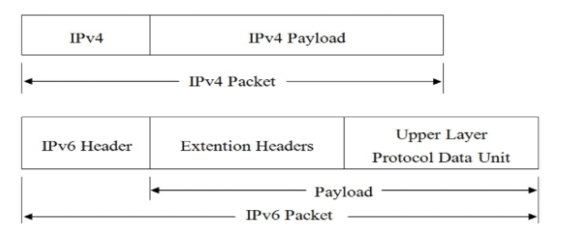

IPv4 được phát triển vào năm 1983

cấu trúc của Ipv4 gồm có 32 bits và người ta gom lại cứ 8 bits là một octets.
Địa chỉ IP được chia thành hai phần: phần mạng (network) và phần host.

Việc đặt địa chỉ IP phải tuân 

Theo các quy tắc sau:

- Các bit phần mạng không được phép đồng thời bằng 0.

Ví dụ: Địa chỉ 0.0.0.1 với phần mạng là 0.0.0 và phần host là 1 là không hợp lệ.

- Nếu các bit phần host đồng thời bằng 0, ta có một địa chỉ mạng.

Ví Dụ: Địa chỉ 192.168.1.1 là một địa chỉ có thể gán cho host nhưng địa chỉ 192.168.1.0 là một địa chỉ mạng, không thể gán cho host được.

Nếu các bit phần host đồng thời bằng 1, ta có một địa chỉ broadcast.

Ví dụ: Địa chỉ 192.168.1.255 là địa chỉ broadcast cho mạng 192.168.1.0

Với IPv4 chúng ta có 2 loại địa chỉ là ip Public và ip private.

Ip Public thì thường dành cho các host ở trên internet

ip private là các host ở trong mạng LAN

IPv4 được trải qua 5 dải mạng 
là 

A 1.0.0.0 đến 127.255.255.255

B 128.0.0.0 đến 192.255.255.255

C 192.0.0.0 đến 223.255.255.255

D 224.0.0.0 đến 239.255.255.255

E 240.0.0.0 đến 255.255.255.255

IPv6 được phát triển vào năm 1996

Trong IPV6, thay vì sử dụng một địa chỉ nguồn và đích là 32bit để cung cấp khoảng 4.294.967.296 (232) địa chỉ  như IPv4, địa chỉ IPv6 có chiều dài 128bit, do đó độ dài của IP sẽ lớn hơn,tương đương với việc số địa chỉ được tạo ra từ bội số 128bit sẽ lớn hơn rất nhiều ,có thể lên đến 3.4x1038 địa chỉ.Ngoài ra,có một vài sự khác nhau trong cách biểu diễn địa chỉ của IPv6, một địa chỉ IPv6 thường được viết thành 8 nhóm, mỗi nhóm gồm có 4 số hex và mỗi nhóm được tách biệt với nhau bằng dấu “:”

Cấu trúc IPv6 gồm 2 phần:

Payload: là sự kết hợp của Extension và PDU.Thông thường có thể lên tới 65535 byte.PDU thường bao gồm header của giao thức tầng cao và độ dài của nó, còn Extension là những thông tin liên quan đến dịch vụ kèm theo trong IPv6 được chuyển tới một trường khác và nó có thể có hoặc không.

IPv6 Header: là thành phần luôn phải có trong một gói tin IPv6 và cố định 40 bytes

- Version: 4 bits giúp xác định phiên bản của giao thức.

- Traffic class: 8 bits giúp xác định loại lưu lượng.

- Flow label: 20 bits giá mỗi luồng dữ liệu.

- Payload length: 16 bits (số dương).Giúp xác định kích thước phần tải theo sau IPv6 Header.

- Next-Header: 8 bits giúp xác định Header tiếp theo trong gói  tin.

- Hop Limit: 8 bits (số dương). Qua mỗi node, giá trị này giảm 1 đơn vị ( giảm đến 0 thì gói bị loại bỏ).

- Source address: 128 bits mang địa chỉ IPv6 nguồn của gói tin.

IPv6 cung cấp một số chế độ địa chỉ mà theo đó một máy chủ có thể được xử lý như: Unicast, Multicast và Anycast.

Địa chỉ Unicast

Trong chế độ địa chỉ unicast, máy chủ được xác định duy nhất trong một phân đoạn mạng. Gói IPv6 chứa cả địa chỉ IP nguồn và đích. Giao diện máy chủ được trang bị một địa chỉ IP duy nhất trong phân khúc mạng đó. Khi bộ chuyển mạch mạng hoặc bộ định tuyến nhận được gói IP unicast thì nó được gửi đến một máy chủ duy nhất

Địa chỉ Multicast

Chế độ Multicast IPv6 giống như của IPv4. Gói tin được gửi đến nhiều node với một địa chỉ multicast đặc biệt. Tất cả các node quan tâm đến thông tin phát multicast đó, trước tiên cần tham gia nhóm multicast .Toàn bộ các node tham gia nhóm đều sẽ nhận được gói phát multicast này và xử lý nó, trong khi các node khác không quan tâm đến gói phát multicast đó thì bỏ qua.

Địa chỉ Anycast

IPv6 đã giới thiệu một loại địa chỉ mới, được gọi là địa chỉ Anycast.Trong chế độ địa chỉ này, nhiều Hosts được gán cùng một địa chỉ IP Anycast. Khi một node muốn liên lạc với một node được trang bị địa chỉ IP Anycast, nó sẽ gửi một tin nhắn Unicast.Tin nhắn này sẽ không được gửi đến tất cả các node trong nhóm giống như Multicast mà với sự trợ giúp của cơ chế định tuyến, thông điệp Unicast đó được gửi đến node gần nhất trong nhóm với người gửi(tính theo thủ tục định tuyến) .

