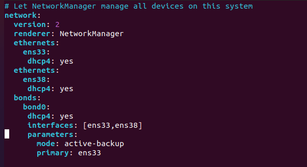
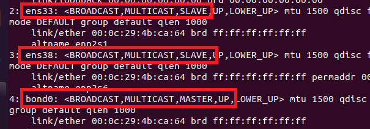
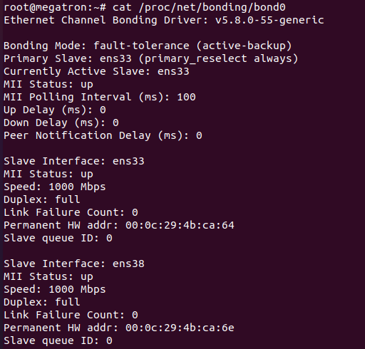

## Network Bonding

Network bonding hiểu một cách đơn giản là cấu hình 2 hay nhiều card mạng chạy song song nhau, hỗ trợ nhau hay nói cách khác là cân bẳng tải và đảm bảo tính sẵn sàng cao cho server, nếu 1 trong 2 card bị down thì dịch vụ trên server vẫn chạy bình thường bằng các card mạng khác.

Cài gói ifenslave

---
- apt-get install ifenslave
---

## Cách Cấu Hình

---
- sudo vim /etc/netplan/01-network-manager-all.yaml
---

|bond mode|mô tả|
|-|-|
|balance-rr (mode=0)|Áp dụng cơ chế Round-robin cung cấp khả năng cân bằng tải và chịu lỗi|
|active-backup (mode=1)|Áp dụng cơ chế Active-backup. Tại một thời điểm chỉ có 1 slave interface active, các slave khác sẽ active khi nào slave đang active bị lỗi.|
|balance-xor (mode=2)|Áp dụng phép XOR: thực hiện XOR MAC nguồn và MAC đích, rồi thực hiện modulo với số slave. Mode này cung cấp khả năng cân bằng tải và chịu lỗi|
|broadcast (mode=3)|Gửi tin trên tất cả các slave interfaces. Mode này cung cấp khả năng chịu lỗi.|
|802.3ad (mode=4 )| IEEE 802.3ad. Mode này sẽ tạo một nhóm tập hợp các intefaces chia sẻ chung tốc độ và thiết lập duplex (hai chiều). Yêu cầu để sử dụng mode này là có Ethtool trên các drivers gốc để đạt được tốc độ và cấu hình hai chiều trên mỗi slave, đồng thời các switch sẽ phải cấu hình hỗ trợ chuẩn IEEE 802.3ad.|
|balance-tlb (mode = 5)| Cân bằng tải thích ứng với quá trình truyền tin: lưu lượng ra ngoài phân tán dựa trên tải hiện tại trên mỗi slave (tính toán liên quan tới tốc độ). Lưu lượng tới nhận bởi slave active hiện tại, nếu slave này bị lỗi khi nhận gói tin, các slave khác sẽ thay thế, MAC address của đường bond sẽ chuyển sang một trong các slave còn lại.|
|balance-alb (mode=6)|Cân bằng tài thích ứng: bao gồm cả cân bằng tải truyền (balance-tlb) và cân bằng tải nhận (rlb - receive load balancing) đối với lưu lượng IPv4. Cân bằng tải nhận đạt được nhờ kết hợp với ARP. Bondin driver sẽ chặn các bản tin phản hồi ARP gửi bởi hệ thống cụ bộ trên đường ra và ghi đè địa chỉ MAC nguồn bằng địa chỉ MAC của một trong các slaves trên đường bond.|

để kiểm tra rõ thông tin hơn ta vào 

---
- cat /proc/net/bonding/bond0 
---

