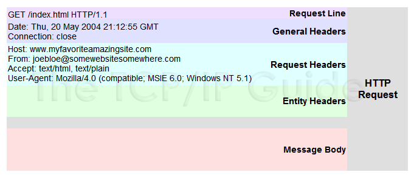
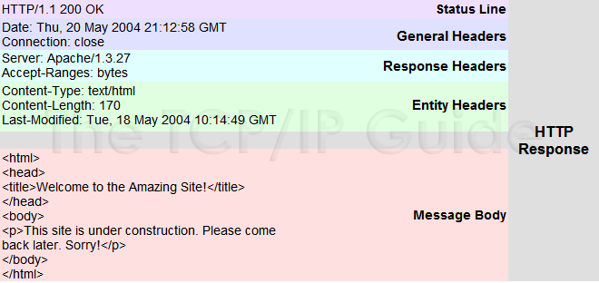

## HTTP là gì?

HTTP (HyperText Transfer Protocol - Giao thức truyền tải siêu văn bản) là một trong các giao thức chuẩn về mạng Internet, được dùng để liên hệ thông tin giữa Máy cung cấp dịch vụ (Web server) và Máy sử dụng dịch vụ (Web client), là giao thức Client/Server dùng cho World Wide Web – WWW

HTTP là một giao thức ứng dụng của bộ giao thức TCP/IP (các giao thức nền tảng cho Internet).

HTTP hoạt động dựa trên mô hình Client – Server. Trong mô hình này, các máy tính của người dùng sẽ đóng vai trò làm máy khách (Client). Sau một thao tác nào đó của người dùng, các máy khách sẽ gửi yêu cầu đến máy chủ (Server) và chờ đợi câu trả lời từ những máy chủ này.

## Các thành phần chính của HTTP

01: HTTP - Requests Message Gồm 3 phần chính là Request line, Header và Body.

Request line:  là dòng đầu tiên của gói HTTP Request, bao gồm 3 trường:

- Phương thức (method) có thể là: GET, POST, HEAD, PUT và DELETE. Hai phương thức phổ biến nhất là GET và POST.

- Đường dẫn (path) dùng để định danh nguồn tài nguyên mà client yêu cầu, bắt buộc phải có ít nhất là dấu “/”.

- Phiên bản giao thức (HTTP version): là phiên bản HTTP client đang sử dụng (thường là HTTP/1.0 hoặc HTTP/1.1)

Header: là các dòng không bắt buộc, viết ở định dạng “Name:Value” cho phép client gửi thêm các thông tin bổ sung về thông điệp HTTP request và thông tin về chính client.

Một số header thông dụng như:

- Accept: loại nội dung có thể nhận được từ thông điệp response. Ví dụ: text/plain, text/html

- Accept-Encoding: các kiểu nén được chấp nhận. Ví dụ: gzip, deflate, xz, exi…

- Connection: tùy chọn điều khiển cho kết nối hiện thời. Ví dụ: Keep-Alive, Close…

- Cookie: thông tin HTTP Cookie từ server

Body: là dữ liệu gửi từ client đến server trong gói tin HTTP request. 
Đa số các gói tin gửi theo phương thức GET sẽ có Body trống, các phương thức như POST hay PUT thường dùng để gửi dữ liệu nên sẽ có bao gồm dữ liệu trong trường Body.

---
- GET /path?key1=value1&key2=value2&…&keyn=valuen HTTP/1.1
---
Dữ liệu gửi lên như vậy gọi là một chuỗi truy vấn (query string), được bắt đầu bằng dấu “?” và kế tiếp là các cặp “key=value”. Trong đó giá trị của các key thường sẽ được cung cấp bởi API từ phía server và client sẽ cung cấp dữ liệu của key thông qua value tương ứng

02: HTTP - Responses Message

HTTP response cũng gồm 3 phần chính là: Status line, Header và Body.

Status line gồm 3 trường 

- Phiên bản giao thức (HTTP version): phiên bản của giao thức HTTP mà server hỗ trợ, thường là HTTP/1.0 hoặc HTTP/1.1

- Mã trạng thái (Status code): mô tả trạng thái kết nối dưới dạng số, mỗi trạng thái sẽ được biểu thị bởi một số nguyên. Ví dụ: 200, 404, 302,…

- Mô tả trạng thái (Status text): mô tả trạng thái kết nối dưới dạng văn bản một cách ngắn gọn, giúp người dùng dễ hiểu hơn so với mã trạng thái. Ví du: 200 OK, 404 Not Found, 403 Forbiden,…

Header line của gói tin response có chức năng tương tự như gói tin request, giúp server có thể truyền thêm các thông tin bổ sung đến client dưới dạng các cặp “Name:Value”.

Body: là nơi đóng gói dữ liệu để trả về cho client, thông thường trong duyệt web thì dữ liệu trả về sẽ ở dưới dạng một trang HTML để trình duyệt có thể thông dịch được và hiển thị ra cho người dùng.

