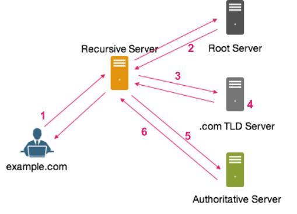

## DNS là gì?

DNS (Domain Name System – hệ thống phân giải tên miền) là một hệ thống giúp con người và máy tính giao tiếp dễ dàng hơn. Con người sử dụng tên, còn máy tính sử dụng số, DNS chính là một hệ thống giúp biên dịch tên hostname (tên miền) thành số để máy tính có thể hiểu được.

Các loại bản ghi DNS

- CNAME Record (Bản ghi CNAME): Cho phép tạo một tên mới, điều chỉnh trỏ tới tên gốc và đặt TTL. Tóm lại, tên miền chính muốn đặt một hoặc nhiều tên khác thì cần có bản ghi này. 

- A Record: Bản ghi này được sử dụng phổ biến để trỏ tên Website tới một địa chỉ IP cụ thể. Đây là bản ghi DNS đơn giản nhất, cho phép thêm Time to Live (thời gian tự động tái lại bản ghi), một tên mới và Points To ( Trỏ tới IP nào).

- MX Record: Với bản ghi này, có thể trỏ Domain đến Mail Server, đặt TTL, mức độ ưu tiên (Priority). MX Record chỉ định Server nào quản lý các dịch vụ Email của tên miền đó.

- AAAA Record: Để trỏ tên miền đến một địa chỉ IPV6 Address, bạn sẽ cần sử dụng AAA Record. Nod cho phép thêm Host mới, TTL,IPv6.

- TXT Record: Có thể thêm giá trị TXT, Host mới, Points To, TTL. Để chứa các thông tin định dạng văn bản của Domain.

- SRV Record: Là bản ghi dùng để xác định chính xác dịch vụ nào chạy Port nào. Đây là Record đặc biệt trong DNS. Thông qua nó, có thể thêm Name, Priority, Port, Weight, Points to, TTL.

- NS Record: Với bản ghi này, có thể chỉ định Name Server cho từng Domain phụ. Có thể tạo tên Name Server, Host mới, TTL.

Tổng cộng có khoảng 4 loại server tham gia vào trong hệ thống phân giải tên miền

01: DNS Recursor

- DNS recursor là server đóng vai trò liên lạc với các server khác để thay nó làm nhiệm vụ phản hồi cho client (trình duyệt người dùng). Nó như một nhân viên cần mẫn nhận nhiệm vụ lấy và trả thông tin cho client (trình duyệt) để tìm đúng thông tin chúng cần. Để lấy được thông tin, DNS recursor có thể sẽ cần gọi đến Root DNS Server để trợ giúp.

02: Root Nameserver

- Root DNS Server, cũng thường được gọi là nameserver, là server quan trọng nhất trong hệ thống cấp bậc của DNS. Nó không có tên cụ thể. Bạn có thể hiểu nó là một thư viện để định hướng tìm kiếm giúp bạn.
Trên thực tế, DNS recursive resolver sẽ chuyển yêu cầu tới Root Nameserver. Sau đó, server này sẽ phản hồi rằng nó cần tìm trong các top-level domain name servers (TLD nameserver) cụ thể nào.

03: TLD Nameserver

- Khi bạn muốn truy cập Google hay Facebook, thường phần mở rộng của bạn sẽ dùng là .com. Nó là một trong các top-level domain. Server cho loại top-level domain này gọi là TLD nameserver. Nó chịu trách nhiệm quản lý toàn bộ thông tin của một phần mở rộng tên miền chung.

04: Authoritative Nameserver

- Khi một DNS resolver tìm thấy một authoritative nameserver, đây là việc phân giải tên miền diễn ra. Authoritative nameserver có chứa thông tin tên miền gắn với địa chỉ nào. Nó sẽ đưa cho recursive resolver địa chỉ IP cần thiết tìm thấy trong danh mục các bản ghi của nó.

