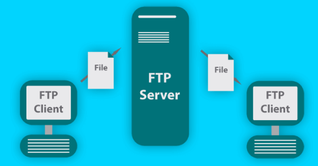
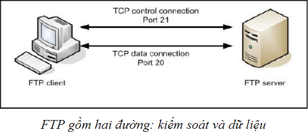

## FTP là gì?

FTP viết tắt từ File Transfer Protocol, là một giao thức truyền tải tập tin từ máy tính này đến máy tính khác thông qua một mạng TCP hoặc qua mạng Internet. Nhờ vào giao thức này nên người sử dụng có thể tải dữ liệu như hình ảnh, văn bản, các tập tin nhạc, video... từ máy tính của mình lên máy chủ đang đặt ở một nơi khác hoặc tải các tập tin đã có trên máy chủ về máy tính cá nhân của mình một cách dễ dàng. FTP cũng là giao thức dùng để truyền tải dữ liệu web lên máy chủ web cho dù máy chủ đặt rất xa.

## FTP hoạt động như thế nào?

FTP hoạt động dựa trên hai tiến trình cơ bản là kiểm soát kết nối và kết nối dữ liệu.Hay còn gọi là Control Connection và Data Connection.

- Control connection (kiểm soát kết nối):Đây là phiên làm việc TCP logic đầu tiên được tạo ra khi quá trình truyền dữ liệu bắt đầu. Tuy nhiên, tiến trình này chỉ kiểm soát các thông tin điều khiển đi qua nó, ví dụ như các tập lệnh. Quá trình này sẽ được duy trì trong suốt quá trình phiên làm việc diễn ra.

- Data connection (kết nối dữ liệu): Khác với Control connection đây là một kết nối dữ liệu TCP được tạo ra với mục đích chuyên biệt là truyền tải dữ liệu giữa máy Client và máy Server. Kết nối sẽ tự động ngắt khi quá trình truyền tải dữ liệu hoàn tất.

## FTP truyền tải như thế nào?

FTP truyền tải này được thực hiện theo 3 phương thức khác nhau là: Stream mode, Block mode, và Compressed mode.

- Stream mode: Là dữ liệu được truyền đi dưới dạng byte có cấu trúc tách rời, không liên tục. Hoạt động dựa vào tính tin cậy trong việc truyền dữ liệu giao thức TCP. Bên gửi chỉ có thể đẩy luồng dữ liệu qua kết nối TCP tới bên nhận một cách đơn thuần, không có trường tiêu đề cố định.

- Block mode: Các dữ liệu truyền được chia làm nhiều đoạn nhỏ sau đó được đóng gói lại thành các FTP blocks, mỗi gói đều chứa thông tin dữ liệu và điều này sẽ là việc truyền nhận dữ liệu an toàn, đúng chuẩn hơn.

- Compressed mode: Là phương thức áp dụng kỹ thuật nén dữ liệu "run-length encoding”. Phương thức này loại bỏ những đoạn dữ liệu lặp lại để giảm chiều dài dữ liệu khi chuyển đi. Giúp quá trình truyền dữ liệu nhanh hơn.

