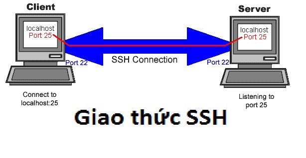
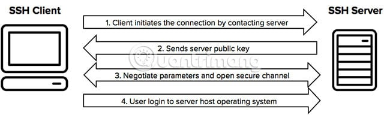

## SSH là gì

SSH được gọi là (Secure Shell) và có một tên khác là Secure Socket Shell, là một giao thức mạng cung cấp cho quản trị viên một cách an toàn để truy cập máy tính từ xa. SSH cũng đề cập đến bộ tiện ích thực hiện giao thức. Secure Shell cung cấp khả năng xác thực mạnh và bảo mật thông tin liên lạc giữa hai máy tính kết nối qua mạng không an toàn như Internet

## SSH hoạt động như thế nào?

SSH làm việc thông qua 3 bước đơn giản:

• Định danh host - xác định định danh của hệ thống tham gia phiên làm việc SSH.

• Mã hoá - thiết lập kênh làm việc mã hoá.

• Chứng thực - xác thực người sử dụng có quyền đăng nhập hệ thống

Lệnh SSH có 3 phần: ssh {user}@{host} 

- SSH có ý nghĩa là người dùng muốn mở kết nối được mã hoá Secure Shell Connection.

- {user} là tài khoản người dùng được truy cập. Chẳng hạn, muốn truy cập user root, người dùng chỉ thay root ở đây. User root là quản trị hệ thống người dùng với toàn quyền để chỉnh sửa mọi thứ trên hệ thống

- {host} đại diện cho máy tính muốn người dùng truy cập có thể là một tên miền hoặc một địa chỉ IP 

Sau khi Enter, hệ thống yêu cầu người dùng nhập mật khẩu tương ứng cho tài khoản. Khi nhập mật khẩu, nếu không có bất cứ dấu hiệu nào hiện lên màn hình là khi bạn đã nhập đúng mật khẩu và click enter, sau đó tự động bạn vào hệ thống và đăng nhập hoàn tất.

