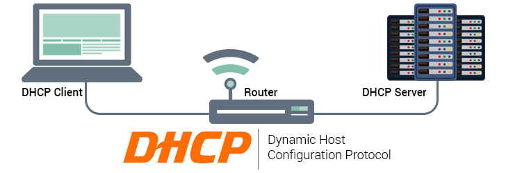
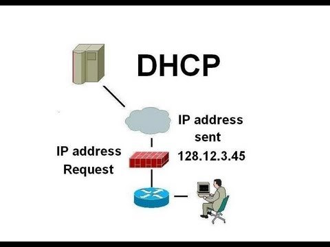

## DHCP là gì?

DHCP viết tắt của Dynamic Host Configuration Protocol, là giao thức tự động cấp phát địa chỉ IP đến các thiết bị trong mạng. Các địa chỉ IP được cung cấp từ giao thức DHCP sẽ cho phép chúng ta truy cập vào internet. Ngoài ra nó cũng đảm bảo không có trường hợp hai hoặc nhiều thiết bị có cùng IP và còn cung cấp các thông tin cấu hình như DNS, subnet mask, default gateway

## Các thành phần của DHCP

DHCP gồm có 6 thành phần:

- DHCP server: Một thiết bị mạng chạy dịch vụ DHCP chứa địa chỉ IP và thông tin cấu hình liên quan. Đây thường là máy chủ hoặc router nhưng có thể là bất cứ thứ gì hoạt động như máy chủ chẳng hạn như thiết bị SD-WAN.

- DHCP client: Thiết bị nhận thông tin cấu hình từ máy chủ DHCP. Đây có thể máy tính, thiết bị di động, thiết bị IoT (Internet of Things) hoặc bất cứ thiết bị gì khác yêu cầu kết nối mạng. Hầu hết các thiết bị này được cấu hình để nhận thông tin DHCP theo mặc định.

- IP address pool: Dãy địa chỉ có sẵn cho client DHCP. Những địa chỉ này thường được truyền tuần tự từ thấp nhất đến cao nhất.

- Subnet: Mạng IP có thể được phân thành các phân đoạn được gọi là subnet (mạng con). Mạng con giúp mạng được quản lý dễ dàng hơn.

- Lease: Khoảng thời gian client DHCP giữ thông tin địa chỉ IP. Khi khoảng thời gian này hết hạn, client phải làm mới nó.

- DHCP relay: Router hoặc máy chủ nghe tin nhắn được phát trên mạng đó và sau đó chuyển chúng đến một máy chủ được cấu hình. Máy chủ này sau đó phản hồi lại relay agent để truyền chúng đến client. Nó được sử dụng để tập trung máy chủ DHCP thay vì để máy chủ trên mỗi mạng con.

