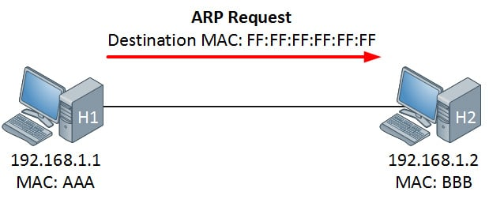
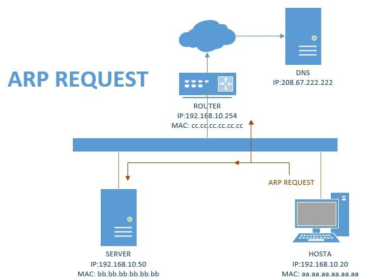

## ARP là gì?

ARP (Address Resolution Protocol) là giao thức mạng được dùng để tìm địa chỉ phần cứng (địa chỉ MAC) của thiết bị từ một địa chỉ IP. Nó được sử dụng khi một thiết bị muốn giao tiếp với các thiết bị khác trên local network (ví dụ trên mạng Ethernet mà yêu cầu địa chỉ vật lý trước khi gửi packets)

## Các loại bản tin ARP

Có hai dạng bản tin trong ARP cơ bản nhất: một là được gửi từ nguồn đến đích, còn một là được gửi từ đích tới nguồn.

- Request: Khi hệ thống khởi tạo quá trình, gói tin được gửi từ máy nguồn tới thiết bị đích

- Reply: Khi quá trình đáp trả gói tin ARP request, được gửi từ thiết bị đích đến máy nguồn

## Phân loại giao thức ARP

ARP được phân thành 4 loại chính:

- Proxy ARP Trong phương pháp Proxy ARP, các thiết bị Layer 3 có thể phản hồi các ARP request. Loại ARP này được cấu hình sao cho router sẽ phản hồi địa chỉ IP đích, và ánh xạ địa chỉ MAC đến địa chỉ IP đích và người gửi khi nó đến được đích.

- Gratuitous ARP là một loại ARP request khác của host. Loại request này giúp mạng có thể xác định các địa chỉ IP bị trùng lặp. Do đó, khi router hay switch gửi ARP request để lấy địa chỉ IP, nó sẽ không nhận được phản hồi ARP nào. Vì vậy cũng không có node nào có thể sử dụng địa chỉ IP được cấp cho router hay swictch đó.

- Reverse ARP (RARP) là một loại giao thức ARP được hệ thống client trong LAN sử dụng để yêu cầu địa chỉ IPv4 của nó từ bảng ARP router. Quản trị viên mạng chủ yếu tạo một bảng trong bộ gateway-router, giúp xác định địa chỉ MAC đến IP cụ thể.

- Inverse ARP (InARP) là một loại ARP dùng để tìm địa chỉ IP của các node từ địa chỉ lớp liên kết dữ liệu. InARP được sử dụng rộng rãi cho các rơ-le frame mạng ATM, trong đó địa chỉ mạch ảo Lớp 2 thu được từ việc signal của Layer 2.

