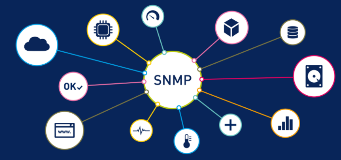

## SNMP là gì ?

SNMP được viết tắt từ Tiếng Anh: Simple Network Management Protocol là một tập hợp các giao thức không chỉ cho phép kiểm tra các thiết bị mạng như router, switch, server mà còn hỗ trợ vận hành các thiết bị một cách tối ưu. Ngoài ra SNMP còn cho phép quản lý thiết bị từ xa.

## Các thành phần của SNMP

Có bốn thành phần chính trong mạng do SNMP quản lý:

- SNMP Agent: Chương trình này chạy trên phần cứng hoặc dịch vụ đang được giám sát, thu thập dữ liệu về các số liệu khác nhau như tình trạng sử dụng băng thông hoặc dung lượng ổ đĩa. Khi được người quản lý SNMP truy vấn, agent sẽ gửi thông tin này lại cho trình quản lý. Một agent cũng có thể chủ động thông báo cho NMS nếu xảy ra lỗi. Hầu hết các thiết bị đi kèm với một SNMP Agent được cài đặt sẵn; Thông thường nó chỉ cần được bật lên và cấu hình.

- Các thiết bị và tài nguyên do SNMP quản lý: Đây là các node mà một agent chạy trên đó.

- Trình quản lý SNMP (còn gọi là NMS): Nền tảng phần mềm này hoạt động như một bảng điều khiển tập trung mà các agent cung cấp thông tin. Nó sẽ chủ động yêu cầu các agent gửi thông tin cập nhật qua SNMP theo định kỳ. Những gì người quản lý mạng có thể làm với thông tin đó phụ thuộc rất nhiều vào số lượng tính năng của NMS. Có một số trình quản lý SNMP miễn phí đang được cung cấp, nhưng chúng thường bị giới hạn về khả năng hoặc số lượng node mà chúng có thể hỗ trợ. Ở mức độ cao hơn, các nền tảng cấp doanh nghiệp cung cấp các tính năng nâng cao cho các mạng phức tạp hơn, với một số sản phẩm hỗ trợ lên đến hàng chục nghìn node.

- Cơ sở thông tin quản lý (Management information base – MIB): Cơ sở dữ liệu này là một file văn bản (.mib) phân loại và mô tả tất cả các đối tượng được sử dụng bởi một thiết bị cụ thể có thể được truy vấn hoặc kiểm soát bằng SNMP. Cơ sở dữ liệu này phải được tải vào NMS để có thể xác định và theo dõi trạng thái của các thuộc tính này. Mỗi mục MIB được gán một định danh đối tượng (OID).

## SNMP hoạt động như thế nào?

Trong hầu hết các trường hợp, SNMP hoạt động trong một mô hình đồng bộ, với giao tiếp được khởi tạo bởi người quản lý SNMP và tác nhân gửi phản hồi. Các lệnh và thông báo này, thường được vận chuyển qua giao thức UDP hoặc TCP/IP, được gọi là đơn vị dữ liệu giao thức (PDU):

- GET: Được tạo bởi trình quản lý SNMP và được gửi đến một agent để lấy giá trị của một biến số nào đó, được xác định bởi OID của nó, trong một MIB .

- RESPONSE: Được gửi bởi agent cho người quản lý SNMP, được phát đi để trả lời yêu cầu GET. Chứa các giá trị của các biến được yêu cầu.

- GETNEXT: Được gửi bởi người quản lý SNMP đến agent để lấy các giá trị của OID tiếp theo trong hệ thống phân cấp của MIB.

- GETBULK: Được gửi bởi người quản lý SNMP cho agent để có được các bảng dữ liệu lớn bằng cách thực hiện nhiều lệnh GETNEXT.

- SET: Được gửi bởi người quản lý SNMP cho agent để đưa ra các cấu hình hoặc lệnh.

- TRAP: Một cảnh báo không đồng bộ được gửi bởi agent đến trình quản lý SNMP để chỉ ra một sự kiện quan trọng, chẳng hạn như lỗi hoặc sự cố, đã xảy ra.

