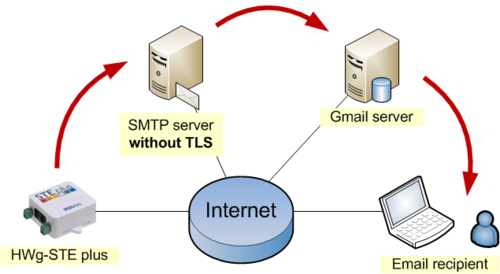

## SMTP là gì ?

SMTP là 3 chữ cái đầu viết tắt của Simple Mail Transfer Protocol dịch ra có nghĩa là giao thức truyền tải thư tín đơn giản hóa. Và giao thức này thực hiện nhiệm vụ chính là gửi mail còn việc nhận mail hay truy xuất dữ liệu mail server sẽ có giao thức IMAP hay POP3 đảm nhiệm.

## POP3 là gì?

- POP3 là viết tắt của Post Office Protocol version 3 là một giao thức tầng ứng dụng, dùng để lấy thư điện tử từ server mail, thông qua kết nối TCP/IP.

- POP3 được sử dụng để kết nối tới server email và tải email xuống máy tính cá nhân thông qua ứng dụng email client như Outlook, Thunderbird, Windows Mail, Mac Mail…

POP3 là giao thức 1 chiều, có nghĩa là email được “kéo” từ email server từ xa xuống email client.

Port mặc định của POP3 là:

---
- Port 110 – port không mã hóa
- Port 995 – SSL/TLS port, cũng có thể được gọi là POP3S
---
## IMAP là gì

IMAP là viết tắt của Internet Message Access Protocol, là giao thức chuẩn Internet được sử dụng bởi các ứng dụng email để truy xuất thư email từ máy chủ thư qua kết nối TCP/IP.

Giống như POP3, IMAP cũng được dùng để kéo email về emails client, tuy nhiên khác biệt với POP3 là nó chỉ kéo email headers về, nội dung email vẫn còn trên server.

Đây là giao thức 2 chiều, thay đổi trên mail client sẽ được chuyển lên server.

Port mặc định của IMAP là:

---
- Port 143 – port không mã hóa

- Port 993 – SSL/TLS port, cũng có thể được gọi là IMAPS.
---

## Cách hoạt động của một smtp

- Việc gửi thông báo được thực hiện bắt đầu bằng việc chuyển thông báo đến một SMTP Server chỉ định.

- Dựa vào tên miền của địa chỉ e-mail nhận, SMTP Server bắt đầu trao đổi liên lạc với một DNS Server mà sẽ tìm kiếm và trả về host name của SMTP Server đích cho tên miền đó.

- Nếu tên người dùng của địa chỉ e-mail nhận trùng khớp với một trong những tài khoản người dùng được phép trong máy chủ đích.

- Thì thông báo e-mail gốc cuối cùng sẽ được đưacđến máy chủ này,  rồi chỉ chờ người nhận lấy thông báo thông qua một chương trình gửi nhận mail như mail server Outlook chẳng hạn.

- Trong trường hợp SMTP Server đầu tiên không thể liên lạc. Và trao đổi thông tin trực tiếp với máy chủ đích, thì giao thức SMTP có cung cấp các cơ chế. Để chuyển các thông báo thông qua một hay nhiều SMTP Server chuyển tiếp trung gian.

- Một máy chủ trung gian sẽ nhận thông báo gốc. Và sau đó sẽ gửi nó tới máy chủ đích hoặc cũng có thể gửi nó một lần nữa tới một máy chủ trung gian khác. Quá trình này sẽ được thao tác nhiều lần cho đến khi thông báo được chuyển đi hoặc thời gian lưu giữ thông báo hết hạn.

