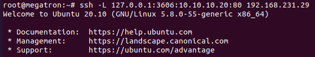
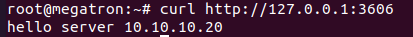
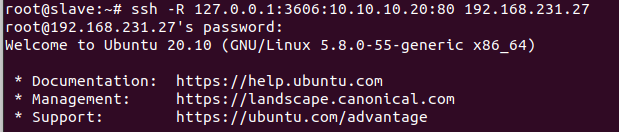
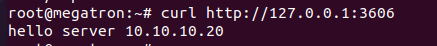

## SSH forward (SSH port forwarding) là gì?

-  SSH forward hay còn được gọi là SSH port forwarding là một cơ chế trong ssh để tunnel các cổng từ máy client đến server và ngược lại. Nó có thể được sử dụng để thêm hoặc sửa một số ứng dụng cũ mà không bị kiểm soát của tường lừa. 

## Cách sử dụng

SSH Port Forwarding có 2 loại một là Local Port Forwarding và Remote Port Forwarding

Local Port Forwarding là tạo một local port để kết nối tới remote sever.

Local Port Forwarding  sử dụng để:

- Kết nối với dịch vụ trong mạng nội bộ từ bên ngoài.

- Sử dụng để chuyển file qua internet.

Ví dụ 

Bạn cài đặt một trang web test ở cổng 80 trên server của bạn, nhưng bạn lại không muốn public trang web đó ra mà chỉ muốn sử dụng ở trên local. Hoặc là bạn đang ở nhà, bạn muốn vào trang web được đặt trên server của công ty mà chỉ được vào với ip nội bộ. Nhưng bạn lại có SSH đến server đó, vậy bạn có thể chuyển tiếp port từ server của công ty về port trên máy bạn bằng cách.

Ta dùng câu lệnh

---
- ssh -L 127.0.0.1:3606:10.10.10.20:80 192.168.231.29
---

- 127.0.0.1 là đại chỉ IP Local

- 3606: là local port để kết nối với server ssh forward 

- 10.10.10.20 là IP private.

- 80: cổng port trang web.

- 192.168.231.29 là server ssh forward 

SSH Remote Port Forwarding cho phép bạn chuyển lưu lượng truy cập từ 1 port ở máy của bạn lên SSH server.

Điều này cho phép bất cứ ai truy cập vào máy chủ public.example.com vào cổng 3606 sẽ được chuyển đến cổng 80 trên máy bạn.

Ví dụ 

Ví dụ bạn đang code 1 website, nhưng khách hàng đang muốn bạn demo từ xa. Do code đang nằm trên máy bạn, và bạn không có thời gian deploy lên server để demo cho khách hàng. Bạn có thể sử dụng Remote Port Forwarding để chuyển cổng web trên máy local lên server để demo cho khách hàng.

Ta dùng câu lệnh

---
- ssh -R 127.0.0.1:3606:10.10.10.20:80 192.168.231.27
---

- 127.0.0.1 là địa chỉ server ssh forward

- 3606 là ssh forward port

- 10.10.10.20 là đại chỉ IP private

- 80 là cổng port trang wed

- 192.168.231.27 là địa chỉ local client

