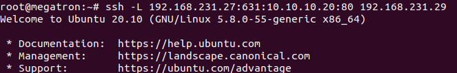
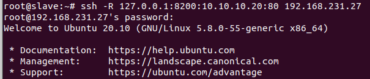

## ssh forward là gì?

-  ssh forward là hay còn gọi một cách khác là SSH Port Forwarding dùng để truy cập ở một một mấy local lên server private , hay một server private về máy local.

## Cách sử dụng

SSH Port Forwarding có 2 loại một là Local Port Forwarding và Remote Port Forwarding

Local Port Forwarding là tạo một local port để kết nối tới remote sever.

Ví dụ 

Muốn xem trang web trong mạng private có địa chỉ IP là 10.10.10.20

Ta dùng câu lệnh

192.168.231.27 là đại chỉ IP Local

631: là cổng LISTEN

10.10.10.20 là IP private.

80: cổng port trang web.

192.168.231.29 là server ssh forward 

ssh -L 192.168.231.27:631:10.10.10.20:80 192.168.231.29

Remote Port Forwarding là ta chuyển port trên remote sever qua internet tới local port

Ví dụ 

Muốn xem trang web trong mạng private có địa chỉ IP là 10.10.10.20
Ta dùng câu lệnh

127.0.0.1 là địa chỉ Local server ssh forward

8200 là cổng LISTEN

10.10.10.20 là đại chỉ IP private

80 là cổng port trang wed

ssh -R 127.0.0.1:8200:10.10.10.20:80 192.168.231.29

