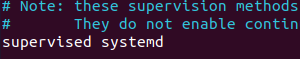
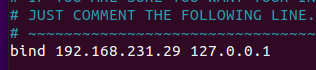
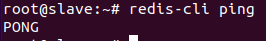
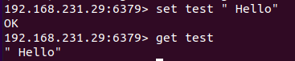

## Redis là gì?

 Redis (REmote DIctionary Server) là một mã nguồn mở được dùng để lưu trữ dữ liệu có cấu trúc, có thể sử dụng như một database, bộ nhớ cache hay một message broker.

 ## Redis dùng để làm gì?

 Redis là một hệ thống dùng để lưu trữ dữ liệu dưới dạng Key - Value mạnh mẽ. Mọi thông tin, dữ liệu đều được redis ghi trên ram thay vì ổ đĩa hay ổ SSD như bình thường. Nhờ việc không cần dùng ổ đĩa hay ổ SSD nên Redis sẽ rút ngắn thời gian tìm kiếm, truy cập dữ liệu. Vì thế mà tốc độ đọc và ghi dữ liệu trên Redis rất nhanh, rất lý tưởng

  ## Redis dùng như thế nào gì?

  - Redis đượng dùng làm bộ nhớ đệm. Có nghĩa là các dữ liệu sẽ được lưu trữ trực tiếp trên máy chủ để có thể giảm bớt được mức độ trễ khi người dùng truy cập vào dữ liệu giữa các ứng dụng hoặc sử dụng như một datebase tạm thời.

  - Redis được dùng để làm database chứa dữ liệu server bình thường. Hoặc được dùng kết hợp với một số database khác như mysql để tăng tốc độ sử lý.

- Redis được dùng để tạo ra hàng đợi để xử lý các request nhanh chóng. Redis cho phép người dùng lưu trữ các danh sách và thao tác các phần tử trong danh sách như một Message Queue. Bởi tốc độ phản hồi chưa đến một mili giây

## Một số kiểu dữ liệu trong Redis

- String: string, integer hoặc float. Redis sẽ xử lý từng phần bên trong String. Cũng như tăng hoặc giảm các giá trị Interger/Float.

- List: Là danh sách các liên kết tập hợp String. Hỗ trợ thêm phần tử vào đầu hoặc cuối của bản ghi, tìm kiếm và chỉnh sửa xóa giá trị.
 
- Set: là dạng tập hợp các String. Redis sẽ đóng vai trò hỗ trợ thêm, ghi, xóa từng phần tử. Cũng như kiểm tra sự xuất hiện các phần tử tập hợp. Redis còn hỗ trợ các phép toán tập hợp, gồm intersect/union/difference.

- Hash: Lưu trữ table của các Key-Values, các Key này được sắp xếp ngẫu nhiên không theo thứ tự. Redis hỗ trợ các thao tác thêm, đọc, xóa từng phần tử, cũng như đọc tất cả giá trị.

- SORTED SET (ZSET): là 1 danh sách, trong đó mỗi phần tử là map của 1 string (member) và 1 floating-point number (score). Danh sách được sắp xếp theo score này. Các phần tử của zset được sắp xếp theo thứ tự từ score nhỏ tới lớn.

## Setup 1 Redis server.

Bước 1 : Ta cần cài các gói cần thiết và cài đặt Redis.

---
- sudo apt-add-repository ppa:chris-lea/redis-server
- sudo apt-get update
- sudo apt-get install redis-server
---

Bước 2: Cấu hình ta vào /etc/redis/redis.conf để cấu hình.

---
- sudo vim /etc/redis/redis.conf 
---

Ta sẽ chỉ định một supervised cho Redis.
Tìm supervised no và thay đổi thành supervised systemd.

Tìm đến dòng bind 127.0.0.1, đây là khai báo redis server sẽ lắng nghe request ở đâu. Thêm địa chỉ IP của server.

Test Redis Serser

