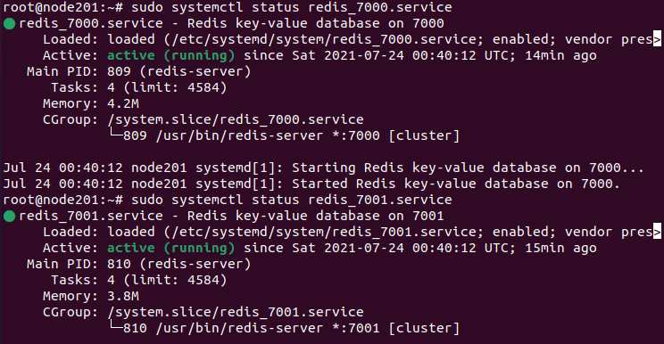
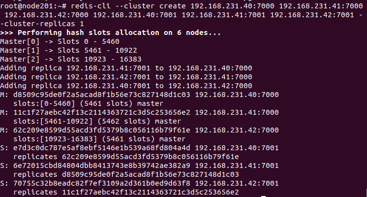
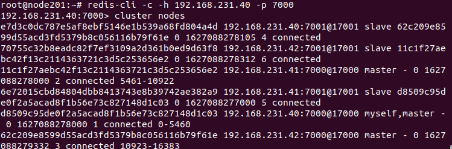

## Redis Cluster Master Slave dùng để làm gì.

Redis Cluster Master Slave dùng để giảm lỗi và tránh mất mát dữ liệu. 

## Redis Cluster Master Slave sử dựng như thế nào.

- Master Node: Là tiến trình chính, chạy và xử lý các kết nối với client.

- Slave Node: là tiến chình phụ, Chạy cùng tiến trình chính và giám sát tiến trình chính. Tiến trình phụ cũng thực hiện việc ghi (dump) dữ liệu định kỳ vào ổ cứng để backup.

Khi Master Node bị treo hay thoát, một trong các tiến trình phụ (Slave Node) trở thành Chính và xử lý tất cả các yêu cầu trong khi Master Node đang được khởi động lại.

## Setup cấu hình Redis Cluster Master Slave

Để setup ta cần có 3 server. Mỗi server là 2 node. 

Cài Các gói cài đặt cần thiết lên cả 3 server

---
- apt update
- apt install redis-server

---

Disable redis-server cả 3 server

---
- systemctl disable redis-server.service
---

Luôn cho các cổng được đi qua firewall cả 3 server

---
- ufw allow 7000
- ufw allow 7001
- ufw allow 17000
- ufw allow 17001
---

Tạo các thư mục cần cho Cluster node cả 3 server

---
- mkdir /etc/redis/cluster
- mkdir /etc/redis/cluster/7000
- mkdir /var/lib/redis/7000
- mkdir /etc/redis/cluster/7001
- mkdir /var/lib/redis/7001
---
Tạo file Cluster node redis_7000.conf cả 3 server

---
- vim /etc/redis/cluster/7000/redis_7000.conf
---

Nội dung của file node redis_7000.conf cả 3 server

---
port 7000
dir /var/lib/redis/7000/
appendonly no
protected-mode no
cluster-enabled yes
cluster-node-timeout 5000
cluster-config-file /etc/redis/cluster/7000/nodes_7000.conf
pidfile /var/run/redis/redis_7000.pid
logfile /var/log/redis/redis_7000.log
loglevel notice
requirepass 
masterauth 

---

Tạo file Cluster node redis_7001.conf cả 3 server

---
- vim /etc/redis/cluster/7001/redis_7001.conf
---

Nội dung của fili node redis_7001.conf cả 3 server

---
port 7001
dir /var/lib/redis/7001
appendonly no
protected-mode no
cluster-enabled yes
cluster-node-timeout 5000
cluster-config-file /etc/redis/cluster/7001/nodes_7001.conf
pidfile /var/run/redis/redis_7001.pid
logfile /var/log/redis/redis_7001.log
loglevel notice
masterauth 
requirepass 

---

Thay đổi quyền cho tất cả các thư mục vừa tạo cả 3 server

---

sudo chown redis:redis -R /var/lib/redis
sudo chmod 770 -R /var/lib/redis
sudo chown redis:redis -R /etc/redis

---

Tạo file  redis_7000.service trong /etc/systemd/system/ cả 3 server

---
- vim /etc/systemd/system/redis_7000.service

--- 

Nội Dung file redis_7000.service cả 3 server

---

[Unit]
Description=Redis key-value database on 7000
After=network.target
[Service]
ExecStart=/usr/bin/redis-server /etc/redis/cluster/7000/redis_7000.conf --supervised systemd
ExecStop=/bin/redis-cli -h 127.0.0.1 -p 7000 shutdown
Type=notify
User=redis
Group=redis
RuntimeDirectory=redis
RuntimeDirectoryMode=0755
LimitNOFILE=65535
[Install]
WantedBy=multi-user.target

---

Tạo file  redis_7001.service trong /etc/systemd/system/ cả 3 server

---

- vim /etc/systemd/system/redis_7001.service

---

Nội Dung file redis_7001.service cả 3 server

---

[Unit]
Description=Redis key-value database on 7001
After=network.target
[Service]
ExecStart=/usr/bin/redis-server /etc/redis/cluster/7001/redis_7001.conf --supervised systemd
ExecStop=/bin/redis-cli -h 127.0.0.1 -p 7001 shutdown
Type=notify
User=redis
Group=redis
RuntimeDirectory=/etc/redis/cluster/7001
RuntimeDirectoryMode=0755
LimitNOFILE=65535
[Install]
WantedBy=multi-user.target

---

Bật redis_7000.service và redis_7001.service cả 3 server

- systemctl enable /etc/systemd/system/redis_7000.service

- systemctl enable /etc/systemd/system/redis_7001.service

Reboot lạihệ thống cả 3 server

---
- reboot
---

Tạo Cluster 

---
redis-cli --cluster create 192.168.231.40:7000 192.168.231.41:7000 192.168.231.42:7000 192.168.231.40:7001 192.168.231.41:7001 192.168.231.42:7001 --cluster-replicas 1

---

- "--cluster-replicas 1" là với mỗi một master sẽ có 1 replicas 

Sau khi chạy xong ta kiểm tra kết quả

---
- redis-cli -c -h 192.168.231.40 -p 7000
---

- "-c " là option hỗ trợ trong redis-cli để kiểm tra cluster
- "-h" là chỉ định địa chỉ IP
- "-p" là cổng port

