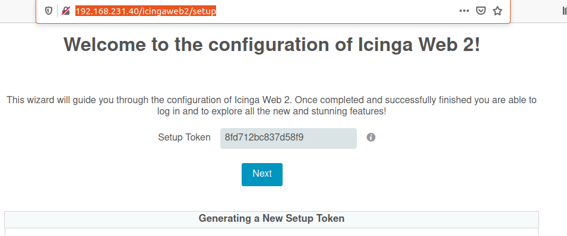
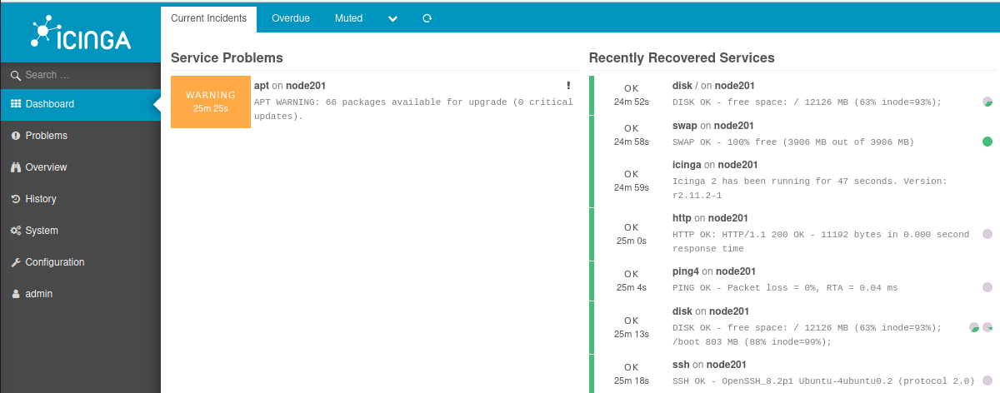
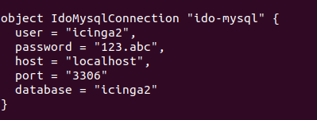
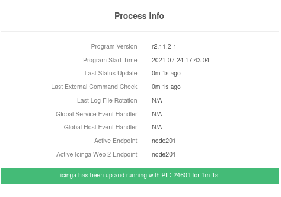
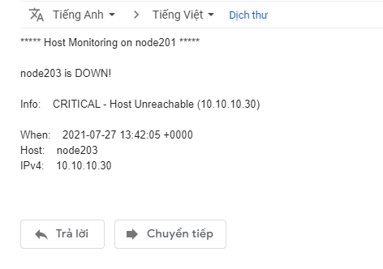
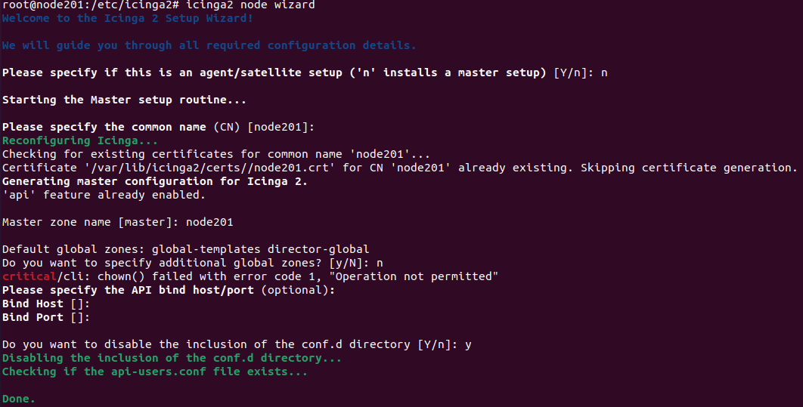
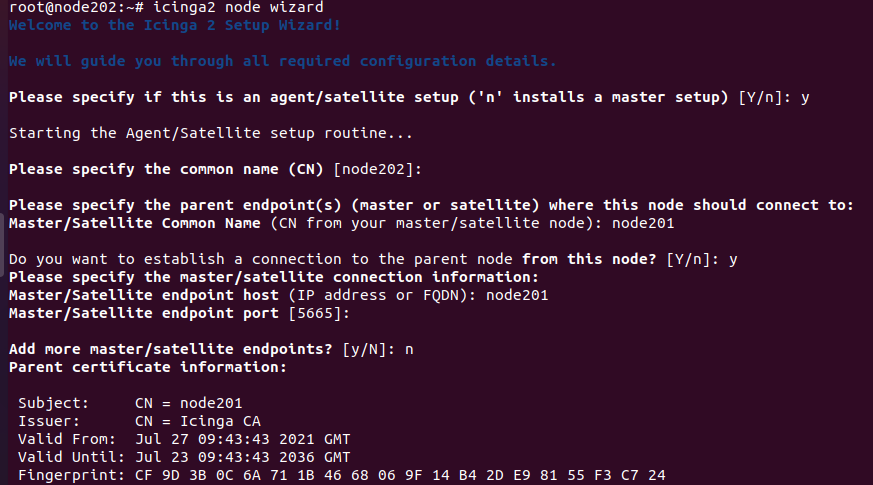
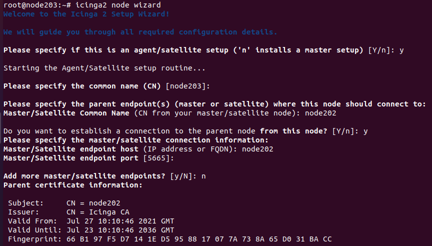

## icinga2 là gì

Icinga là một hệ thống giám sát mã nguồn mở linh hoạt và mạnh mẽ được sử dụng để giám sát hiệu năng của các máy chủ và dịch vụ được nối mạng. Nó có thể được sử dụng để theo dõi tải và thời gian hoạt động của một nhóm web workers, dung lượng đĩa trống trên thiết bị lưu trữ, mức tiêu thụ bộ nhớ trên dịch vụ lưu trữ, v.v. Sau khi thiết lập đúng, Icinga có thể cung cấp tổng quan nhanh về trạng thái số lượng lớn máy chủ và dịch vụ cũng như thông báo, lập lịch thời gian chết và lưu trữ lâu dài dữ liệu hiệu suất.

## Setup cấu hình icinga2

cài các gói cần thiết

---

- sudo apt-get install software-properties-common

- sudo add-apt-repository ppa:ondrej/php

- sudo apt-get update

- apt install php7.3 libapache2-mod-php7.3 php7.3-mysql php-common php7.3-cli php7.3-common php7.3-json php7.3-opcache php7.3-readline php7.3-curl

- apt install apache2

- apt install mariadb-server mariadb-client 
---

setup lại secure cho mariadb

---
- mysql_secure_installation
---

cài đặt icinga2 và icinga2-ido-mysql

---
- apt install icinga2 icinga2-ido-mysql
---

bật icinga2 feature ido-mysql và command

---
- icinga2 feature enable ido-mysql command
---

cài icingaweb2 

---
- apt install icingaweb2
---

tạo database và user icingaweb2

---
- mysql -u root -p
---

---
mysql> create database icingaweb2 ;

mysql> create user 'icingaweb2@'localhost' identified by 'passwd' ;

mysql> grant all privileges on *.* to 'icingaweb2'@'localhost' with grant option ;

mysql> flush privileges ;

mysql> exit

---

Tạo mã xác thực token để setup icingaweb2

icingacli setup token create

---
- http://địa chỉ ip/icingaweb2/setup

---

sau khi cài đặt xong các bước setup giao diện sẽ như thế này.

nếu bị lỗi 

ta vào /etc/icinga2/features-available/ido-mysql.conf thêm port 

---
- vim /etc/icinga2/features-available/ido-mysql.conf
---

## setup cảnh báo về maill khi server gặp sự cố

cài đặt SSMTP

---
- apt install ssmtp mailutils
---

 vào file ssmtp.conf để cài mail sẽ bắm cảnh báo về

---
- vim  /etc/ssmtp/ssmtp.conf
---

nội dung trong file

---

mailhub=smtp.gmail.com:465

UseTLS=yes

FromLineOverride=yes

AuthUser=username

AuthPass=password

---

Kiểm tra xem ssmtp xem có gửi đưuọc mail không

---

- echo "hello world" | mail -s "test subject" sammy@gmail.com
---

sau khi kiểm tra xong ta vào etc/icinga2/conf.d/users.conf để thiết lập cảnh báo. Và đây là mail báo về

## Xây dựng mô hình Phân Tán 

cài các gói cần thiết trên cả 3 server

---
- sudo apt-get install nagios-nrpe-plugin nagios-nrpe-server
---

download plugins check memory trên cả 3 server.

---

- cd /usr/lib/nagios/plugins/

- wget https://raw.githubusercontent.com/justintime/nagios-plugins/master/check_mem/check_mem.pl

---

Tạo file api-user.conf trên master

---

- vim /etc/icnga2/con.d/api-user.conf

---

Điền nội dung file

---

object ApiUser "root" {

  password = "123.abc"

   permissions = [ "actions/generate-ticket" ]
}

---

Thay đổi quyền trên cả 3 server tránh khi wizard bị lỗi.

---
- chown -R :nagios /etc/icinga2/conf.d

- chown -R :nagios /etc/icinga2/features-available

- chmod 776 /etc/icinga2/conf.d

- chmod 776 /etc/icinga2/features-available
---

Bật xác thực CA

---

- icinga2 feature enable api

- icinga2 api setup

---

khởi động lại icinga2

---

- systemctl restart icinga2

---

Chạy wizard node cấu hình master

---

- icinga2 node wizard

---

tạo key CA 

---
- sudo icinga2 pki ticket --cn node202
---

Cấu hình satellite

icinga2 node wizard

---

- systemctl restart icinga2

---

cấu hình client

icinga2 node wizard

---

- systemctl restart icinga2

---

Xong hết quay lại master vào /etc/icinga2/zones.conf 

---
- vim  /etc/icinga2/zones.conf
---

Thêm zones satellite

---

object Endpoint "node202" {

}

object Zone "node202" {

        endpoints = [ "node202" ]

        parent = "node201"

}

---

Tạo thư mục node202 trong zones.d

---
- mkdir zones.d/node202
---

vào thư mục node202 tạo file node203.conf và thêm

---

    object Endpoint "node203" {

     host = "10.10.10.30" 

     log_duration = 0 

    }

    object Zone "node203" {

     endpoints = [ "node203" ]

     parent = "node202"

    }

---

Tạo file hosts.conf và thêm.

----

    object Host "node203" {

     check_command = "hostalive"

     address = "10.10.10.30"

     vars.agent_endpoint = name

     vars.notification["mail"] = {

      groups = [ "icingaadmins" ]

      }

    }
 
Tạo file services.conf và thêm.

---

    apply Service "ping4" {

     check_command = "ping4"

     assign where host.address

     assign where host.vars.  agent_endpoint

    }

    apply Service "disk" {

     check_command = "disk"

     command_endpoint = host.vars.agent_agent_endpoint

     vars.disk_wfree = "20%"

     vars.disk_cfree = "10%"

     assign where host.vars.agent_endpoint
  
    }

    apply Service "cpu-load" {

     check_command = "load"

     vars.load_wload = 0.3

     vars.load_cload = 0.25

     vars.notification.mail = "yes"

     vars.backup_downtime = "02:00-03:00"

    assign where host.vars.agent_endpoint

    } 

    apply Service "mem" {

     check_command = "mem"

     command_endpoint = host.vars.agent_endpoint

     vars.mem_used = true

     vars.mem_cache = true

     vars.mem_warning = 80

     vars.mem_critical = 90

    assign where host.vars.agent_endpoint

    }

khởi động lại icinga2

---
- sudo systemctl restart icinga2

---

