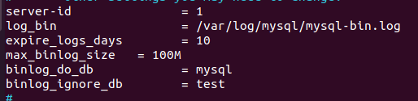
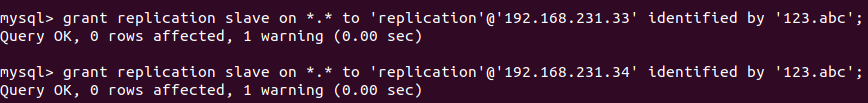
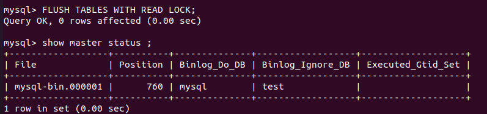
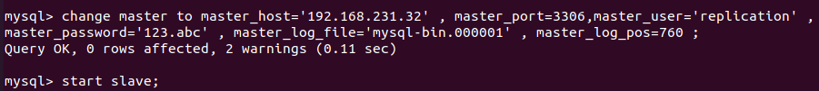
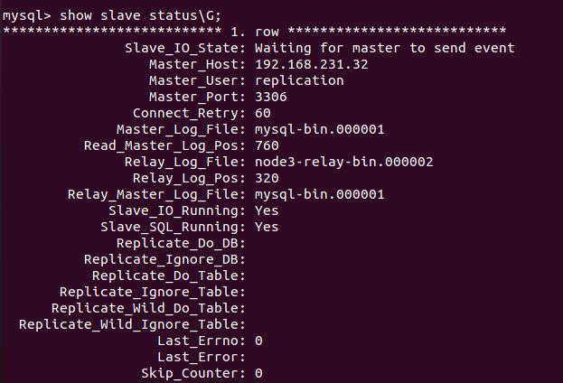
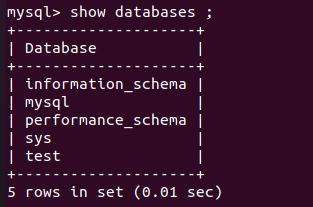
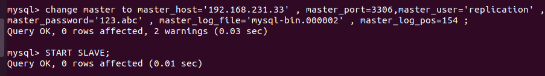
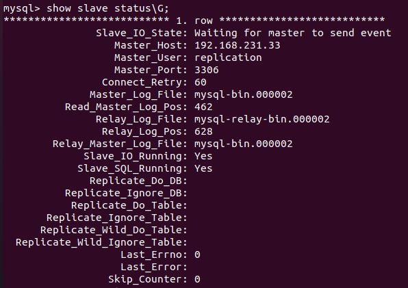
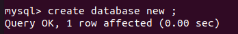

## MySQL là gì?

MySQL là một hệ thống quản trị cơ sở dữ liệu mã nguồn mở (Relational Database Management System, viết tắt là RDBMS) hoạt động theo mô hình client-server. RDBMS là một phần mềm hay dịch vụ dùng để tạo và quản lý các cơ sở dữ liệu (Database) theo hình thức quản lý các mối liên hệ giữa chúng.

## MySQL được sử dụng làm gì

MySQL được sử dụng cho việc bổ trợ NodeJs, PHP, Perl, và nhiều ngôn ngữ khác, làm nơi lưu trữ những thông tin trên các trang web viết bằng NodeJs, PHP hay Perl,...

## Triển khai mô hình cụm cluster master slave với mysql

Cài đặt mysql

---
- apt install mysql-server mysql-client -y
---

vào /etc/mysql/mysql.conf.d/mysqld.cnf cấu hình trên cả 3 server thay server_id = lần lượt là 1,2 và 3

---
- vim /etc/mysql/mysql.conf.d/mysqld.cnf 

---

vào mysql tạo user và phân quyền 

xác định binlog và position

---

FLUSH TABLES WITH READ LOCK;

show master status;

---

Sang 2 server slave vào mysql chạy lệnh

node2

- grant replication slave on *.* to 'replication'@'192.168.231.32' identified by '123.abc';

- change master to master_host='192.168.231.32' , master_port=3306,master_user='replication' , master_password='123.abc' , master_log_file='mysql-bin.000001' , master_log_pos=760 ;

- start slave;

node3

- grant replication slave on *.* to 'replication'@'192.168.231.32' identified by '123.abc';

- change master to master_host='192.168.231.32' , master_port=3306,master_user='replication' , master_password='123.abc' , master_log_file='mysql-bin.000001' , master_log_pos=760 ;

- start slave;

kiểm tra replicaotion trên cả 2 server cho ra kết quả.

test replicotion bằng cách tạo database

Thay thế node master khi master chết.

vào slave mới muốn cần lên thay thế chạy

STOP ALL SLAVES;
RESET SLAVE ALL;
SET @@global.read_only=0;
SHOW MASTER STATUS;

tạo user replication và phân quyền truy cập mới.

sang con slave cũ để chuyển về host mới.

test và kiểm tra kết quả slave mới đã haotj động lại bình thường.

tạo database mới từ master mới.

sang salve kiểm tra.

Thay thế node slave khi slave chết tương tự như khi ta làm mới slave.

