## MongoDB là gì ?

MongoDB là một dạng phần mềm cơ sở dữ liệu sử dụng mã nguồn mở NoSQL. Nó có thể hỗ trợ trên nhiều nền tảng khác nhau và được thiết kế với mục đích hướng đến đối tượng. MongoDB hoạt động dựa vào các khái niệm Collection và Document. Đồng thời, nó có hiệu suất cao cùng với tính khả dụng tốt và dễ dàng mở rộng.

## MongoDB dùng để làm gì?

MongoDB dùng cho website cần có tính năng thêm dữ liệu thường xuyên, bởi MongoDB có thể ghi với tốc độ cao và cực kỳ bảo mật.Điều này giúp trang web không bị downtime khi cập nhật dữ liệu.

MongoDB dùng cho hệ thống dữ liệu với dung lượng lớn và cần truy vấn nhanh.

MongoDB dùng trong các ứng dụng mobile.Cho phép lưu trữ dữ liệu ứng dụng back-end ở bất cứ đâu , kể cả trong các thiết bị Apple iOS và Android cũng như các giải pháp lưu trữ dựa trên đám mây.

## Cài đặt và cấu hình cluster Mongodb

chúng ta cần tối thiểu là 3 server

thêm máy chủ vào file hosts

---
- vim /etc/hosts
---
192.168.231.32 node1
192.168.231.33 node2
192.168.231.34 node3

tải và cài đặt các bản cần thiết.

---
- sudo apt update

- sudo apt-key adv --keyserver hkp://keyserver.ubuntu.com:80 --recv 9DA31620334BD75D9DCB49F368818C72E52529D4

- echo "deb [ arch=amd64 ] https://repo.mongodb.org/apt/ubuntu bionic/mongodb-org/4.0 multiverse" | sudo tee /
etc/apt/sources.list.d/mongodb-org-4.0.list

- sudo apt update

- sudo apt install mongodb-org -y
---

 tạo thư mục chưa key trên cả 3 server

---
-  sudo mkdir /var/lib/mongodb-pki
---

tạo key với openssl

---
- openssl rand -base64 741 > keyfile

---

coppy key sang 2 server slave

---
 - scp ./keyfile 192.168.231.33:/var/lib/mongodb-pki
 - scp ./keyfile 192.168.231.33:/var/lib/mongodb-pki
---

Thay đổi quyền trên cả 3 server.

---

- sudo chmod 600 /var/lib/mongodb-pki/keyfile

- sudo chown -R mongodb:mongodb /var/lib/mongodb-pki

---

vào /etc/mongo.conf trên cả 3 server và sửa

thêm sửa địa chỉ ip

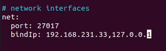

thêm operationProfiling,security,replication. trên cả 3 server.

---

operationProfiling:

  mode: "slowOp"

  slowOpThresholdMs: 50

security:

  authorization: enabled

  keyFile: /var/lib/mongodb-pki/keyfile

replication:

  replSetName: "replset"

---

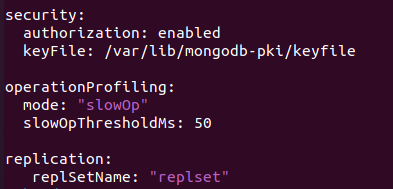

bật và khởi động lại mongod

---
- sudo systemctl enable mongod
- sudo systemctl restart mongod
---

truy cập vào host master bằng câu lệnh

---
- mongo --host 127.0.0.1 --port 27017
---

gõ 

---
 use admin

 rs.initiate()

---

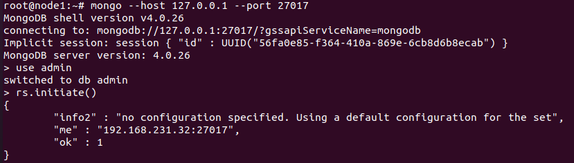

Tạo  user passwd db admin   

---

db.createUser({user: "mongo-admin", pwd: "mongo-pass", roles: [{role: "root", db: "admin"}]})

---

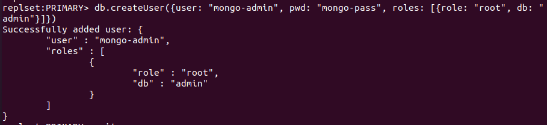

giờ ta sẽ truy cập bằng  user passwd db admin vừa tạo trên master và kiểm tra status()

---

 mongo --host 192.168.231.32:27017 --username mongo-admin --password mongo-pass --authenticationDatabase admin

---

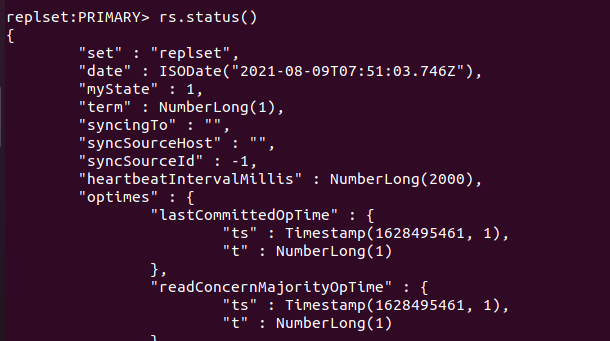

Status báo là ta đang là PRIMARY  

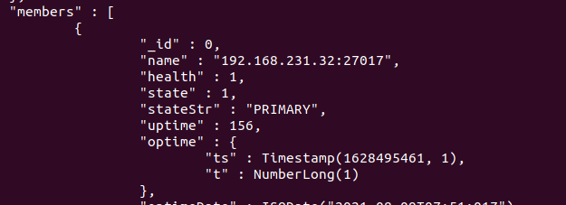

giờ ta sẽ add xác nhận node đấy là master và add các node slave.

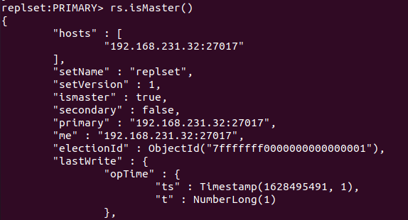

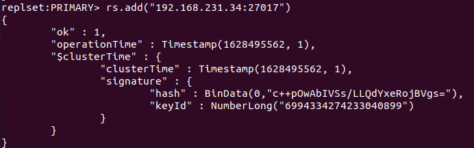

Kiểm tra lại status máy báo đã có thêm vào 2 SECONDARY

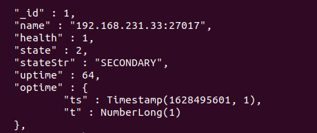

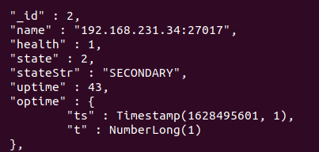

giờ ta sang 2 server slave kéo database về bằng câu lệnh rs.slaveOk() và kiểm tra.

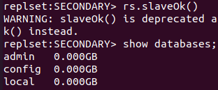

kiểm tra rep có hoạt động hay không

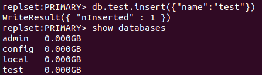

kiểm tra các máy slave và đây là kết quả

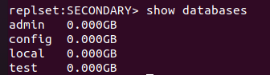

kiểm tra khi một node master chết

rs.isMaster()['me']

trước

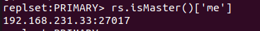

và sau khi master chết

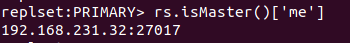

