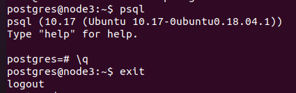
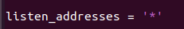
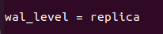
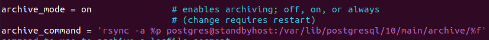
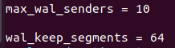
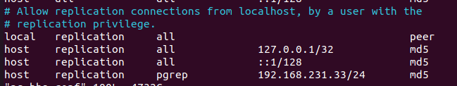
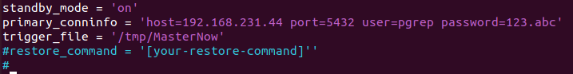
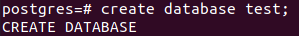
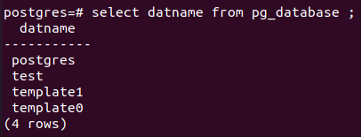
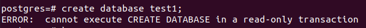

## PostgreSQL là gì?

PostgreSQL là một hệ thống quản trị dữ liệu mở dành cho các doanh nghiệp. Hệ thống quản lý này tương thích với nhiều nền tảng khác nhau, sử dụng được đa dạng ngôn ngữ và phần mềm trung gian phổ biến hiện nay.

## PostgreSQL dùng để làm gì?

PostgreSQL dùng để chạy các trang web và ứng dụng web động.

PostgreSQL dùng để ghi nhật ký viết trước làm cho một cơ sở dữ liệu có khả năng chịu lỗi cao

## Cấu hình cluster master slave 

Cài đặt PostgreSQL

---
- sudo apt update
---
---
- sudo apt-get install postgresql postgresql-contrib postgresql-client
---

lúc cài đặt đã tạo một tài khoản người dùng được gọi là postgres giờ ta kích hoạt nó.

---
- sudo -i -u postgres
---

Sau đó,có thể truy cập lời nhắc Postgre

---
- psql
---
để thoát ra

vào /etc/postgresql/10/main/postgresql.conf

---
- vim /etc/postgresql/10/main/postgresql.conf
---

---
- rsync -a %p postgres@standbyhost:/var/lib/postgresql/10/main/archive/%f
---

tạo /archive và phân quyền

---

- mkdir -p /var/lib/postgresql/10/main/archive/

- chmod 700 /var/lib/postgresql/10/main/archive/

- chown -R postgres:postgres /var/lib/postgresql/10/main/archive/

---

vào /etc/postgresql/10/main/pg_hba.conf thêm

---

vào psql tạo user pgrep 

---

postgres=# create user pgrep with replication encrypted password '123.abc';

---

kiểm ta user 

---
\du

---

khởi động lại 

---
- service postgresql restart
---

Sang server slave vào /etc/postgresql/10/main/postgresql.conf

---
- vim /etc/postgresql/10/main/postgresql.conf
---

---
- service postgresql restart
---

chuyển sang user postgres gõ

---
- pg_basebackup -h 192.168.231.44 -D /var/lib/postgresql/10/main/ -P -U pgrep --wal-method=stream
---

tạo file recovery.conf

---
- vim recovery.conf
---
và thêm

---

standby_mode = 'on'

primary_conninfo = 'host=192.168.231.44 port=5432 user=pgrep password=123.abc'

trigger_file = '/tmp/MasterNow'

#restore_command = '[your-restore-command]''

---

tạo thử database ở master để kiểm tra

và kết quả

---
- select datname from pg_database ;
---

tạo thử database ở slave để kiểm tra

---
- create database test1;
---

kết quả

