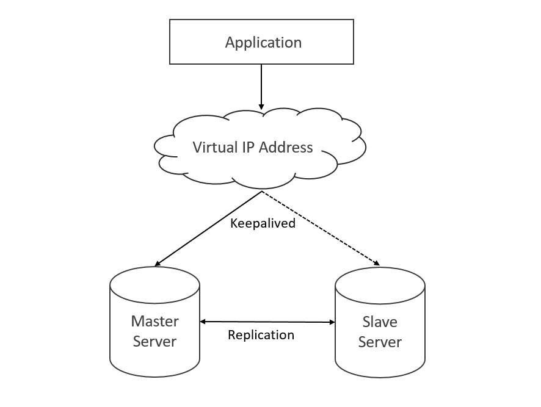
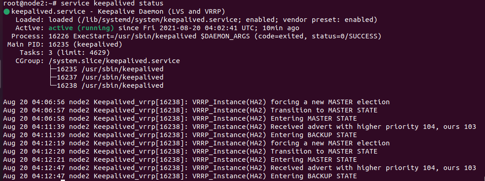
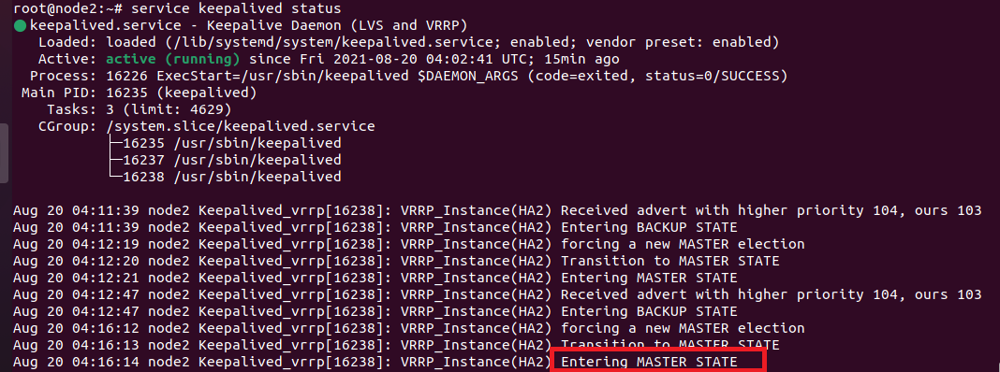

## Keepalived là gì?

Keepalived là một phần mềm định tuyến được viết bằng C và có tính khả dụng cao trong Linux. Nó sử dụng Máy chủ ảo Linux (LVS) để thực hiện các tác vụ cân bằng tải và chuyển đổi dự phòng. Keepalived có thể được sử dụng để giám sát hệ thống và tự động chuyển đổi dự phòng sang chế độ chờ nếu sự cố xảy ra. Nếu máy chủ chính gặp sự cố, IP sẽ tự động được chuyển đến máy chủ thứ hai, cho phép dịch vụ tiếp tục.

## Keepalived hoạt động như thế nào?

Trong thiết lập cơ sở dữ liệu Master-Slave Replication, khi Master bị lỗi, chúng ta cần thực hiện các thay đổi cấu hình theo cách thủ công để chuyển đổi dự phòng sang máy chủ khả dụng tiếp theo. Khi điều này xảy ra, ​​sẽ có down time.

Keepalived là một tiện ích cung cấp tính năng chuyển đổi dự phòng . Với việc triển khai tốt Keepalived, bạn sẽ có thể chuyển đổi dự phòng một địa chỉ IP ảo khi máy chủ chính bị down và tự động chuyển IP đó sang máy chủ dự phòng. Do đó, máy chủ thứ hai sẽ xử lý lưu lượng truy cập mà không có bất kỳ down time nào trong môi trường production

## Triển kịch bản thay thế khi 1 cluster đang chạy bị down không thể stop cluster đi để join node mới vào được với KeepAlived :

---

OS : Ubuntu 18.04

server master IP : 192.168.231.44 - hostname : node1

server slave IP : 192.168.231.33 - hostname : node2

Virtual IP : 192.168.231.10/24

Demo với mysql .

---

# 1. cài đặt keeplived trên cả 2 server

---
- apt install keepalived -y
---

2. Tạo script MySQL Health Check trên cả 2 sever

---
- vim /usr/local/script/mysql_health_check.sh
---

và thêm

---
    #!/bin/bash

    # MySQL Credentials
    MYSQL_HOST="localhost"
    MYSQL_PORT="3306"
    MYSQL_USERNAME="root"
    MYSQL_PASSWORD="XXXXXXXXXXXX"

    mysql -h $MYSQL_HOST -P $MYSQL_PORT -u $MYSQL_USERNAME  -p$MYSQL_PASSWORD --connect_timeout=5 -Bse 'SELECT version();'

    if [ $? -ne 0 ]; then
     echo "bad"
     exit 1      # mysql node is bad
    fi

    echo "good"
    exit 0        # mysql node is good

---

# 2.1: cấu hình keeplived trên master 

---
- vim /etc/keepalived/keepalived.conf 
---
---
    global_defs {
     notification_email {
      krishna.prajapati@xxxxxxxxxxxxxx.xx
      root@localhost
    }
     router_id HAPROXY
    } 

    vrrp_script chk_mysql {
     script   "/usr/local/script/mysql_health_check.sh"
     interval 2
     weight   2
    }

    vrrp_instance HA1 {
     virtual_router_id 51
     advert_int 1
     priority 102
     state MASTER
     interface ens33
     unicast_src_ip 192.168.231.44 #(ip master)
     unicast_peer {
     192.168.231.33  #(ip slave)               
    }

    virtual_ipaddress {
    192.168.231.10/24 dev ens33 #(ip ảo)
    }
     track_script {
     chk_mysql
     }
    }
---

# 2.2 Sang slave cấu hình keeplived

---
- vim /etc/keepalived/keepalived.conf 
---
---
    global_defs {
     notification_email {
      krishna.prajapati@xxxxxxxxxxxxxx.xx
      root@localhost
      }
     router_id HAPROXY_sec
     }

    vrrp_script chk_mysql {
     script   "/usr/local/script/mysql_health_check.sh"
      interval 2
      weight   2
     }

    vrrp_instance HA2 {
      virtual_router_id 51
      advert_int 1
      priority 101
      state BACHUP
      interface ens33
      unicast_src_ip 192.168.231.33  #(ip slave)  
      unicast_peer {
      192.168.231.44           #(ip master)
    }

     virtual_ipaddress {
      192.168.231.10/24 dev ens33 #(ip ảo)
    }
     track_script {
       chk_mysql
     }
    }
---

khởi động lại server

- systemctl enable keepalived

- service keepalived start

- service keepalived status

 Kiểm tra kết quả

 kiểm tra status master và slave

master

 

slave

 

master down 

kiểm tra status của slave 

