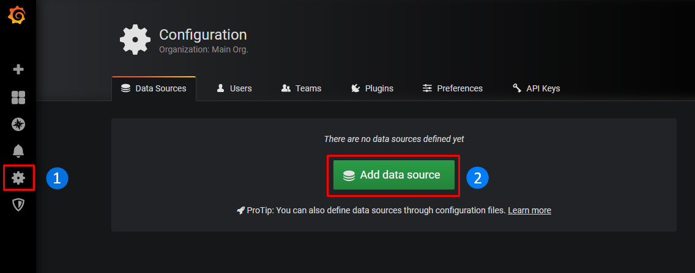
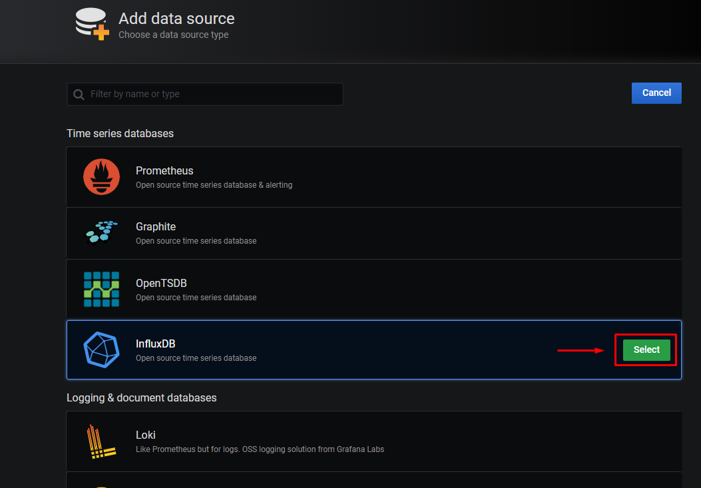
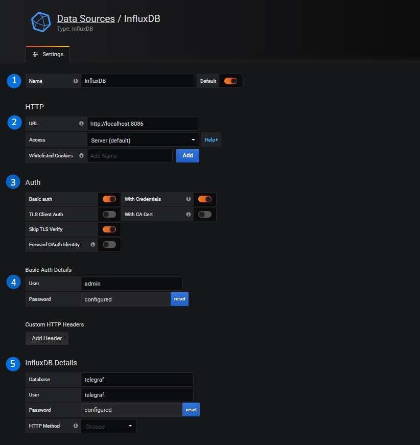
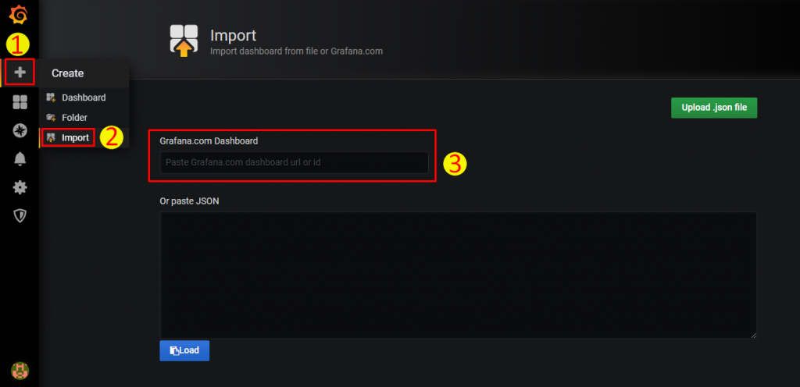
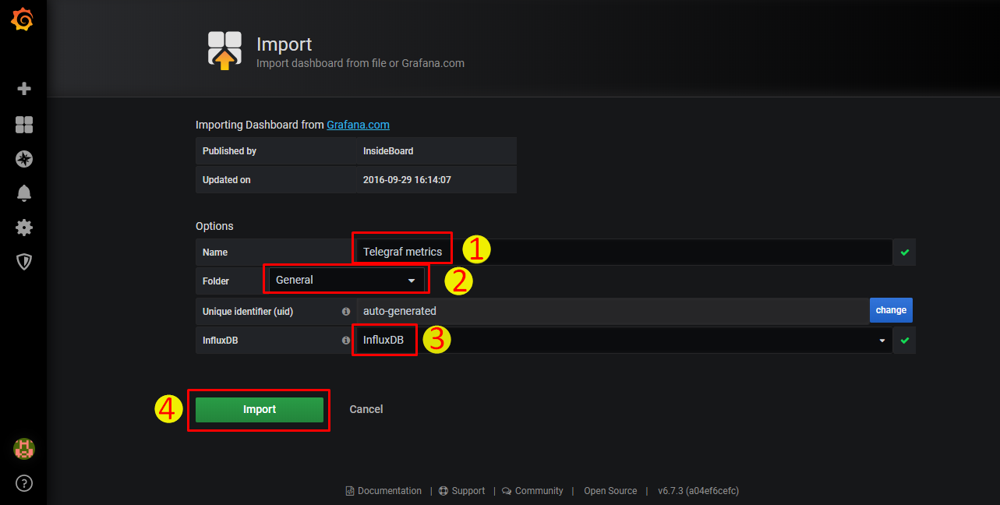
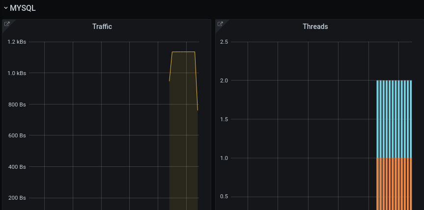

## TIG là gì?

TIG là một stack Monitoring System bao gồm Telegraf – Influxdb – Grafana

## Setup TIG monitor mysql

---

OS: Ubuntu 18.4

Server node201 cài Grafana và Influxdb

Server node1 cài Telegraf

---

# 1 Cài Grafana

1.1 cài các gói cần thiết

    apt install -y apt-transport-https

    apt install -y software-properties-common wget

    apt update

    apt upgrade

1.2 Add key và cài đặt

    wget -q -O - https://packages.grafana.com/gpg.key | apt-key add -

    add-apt-repository "deb https://packages.grafana.com/oss/deb stable main"

    apt update

    apt install -y grafana

1.3 Khởi động dịch vụ và kiểm tra trạng thái

    systemctl start grafana-server

    systemctl enable grafana-server

    systemctl status grafana-server

# 2 Cài Influxdb

1.1  Thêm Influxdata key và cài đặt:

    wget -qO- https://repos.influxdata.com/influxdb.key | apt-key add -

    source /etc/lsb-release

    echo "deb https://repos.influxdata.com/${DISTRIB_ID,,} ${DISTRIB_CODENAME} stable" | tee /etc/apt/sources.list.d/influxdb.list

    apt update -y

    apt install influxdb -y

1.2  Khởi động dịch vụ và kiểm tra trạng thái

    systemctl start influxdb
    systemctl enable influxdb
    systemctl status influxdb

1.3 vào influxdb tạo database

    influx
---
    create database telegraf
    create user telegraf with password 'P@ssw0rd' with all privileges

Kiểm tra lại database và user vừa tạo và thoát

    show databases
    show users
    exit

1.4 Cấu hình InfluxDB

Chỉnh sửa file cấu hình /etc/influxdb/influxdb.conf

    vim /etc/influxdb/influxdb.conf

Sửa các phần sau trong thẻ [http]

---
    [http]
    # Determines whether HTTP endpoint is enabled.
    enabled = true

    # Determines whether the Flux query endpoint is enabled.
    flux-enabled = true

    # The bind address used by the HTTP service.
    bind-address = ":8086"

    # Determines whether HTTP request logging is enabled.
    log-enabled = true
---

## 3 Cài Telegraf Agent

Tùy theo hệ điều hành muốn giám sát mà cách cài đặt Telegraf agent sẽ khác nhau. Xem các câu lệnh cài đặt tai trang web:

https://portal.influxdata.com/downloads/

3.1 Cài đặt

---
    wget https://dl.influxdata.com/telegraf/releases/telegraf_1.14.2-1_amd64.deb

    sudo dpkg -i telegraf_1.14.2-1_amd64.deb

    apt install telegraf -y
---

3.2 Khởi động dịch vụ và trạng thái

    systemctl start telegraf

    systemctl enable telegraf
    
    systemctl status telegraf

3.3 Cấu hình telegraf agent   

    hostname = "node1"

    urls = ["http://192.168.231.40:8086"]

    database = "telegraf"

    username = "telegraf"

    password = "P@ssw0rd"

    [[inputs.cpu]]

     percpu = true

     totalcpu = true

     collect_cpu_time = false

     report_active = false

     [[inputs.disk]]

     ignore_fs = ["tmpfs", "devtmpfs", "devfs", "iso9660", "overlay", "aufs", "squashfs"]

    [[inputs.mysql]]
  
    servers = ["user:passwd@tcp(192.168.231.33:3306)/?tls=false"]

     metric_version = 2

## 4 Một số thao tác sử dụng Grafana

4.1 truy cập vào <địa chỉ IP>:3000. và Thêm InfluxDB làm nguồn dữ liệu (datasource) cho Grafana

4.2 Tìm đến phần InfluxDB -> Chọn Select

4.3 Điền thông tin database và save 

4.4 Import Grafana dashboard

Tìm các dashboard muốn dùng ở trang và nhập ID đã chọn được

   https://grafana.com/grafana/dashboards

4.5 Sau khi nhập ID 

4.6 vào phần MSQL và xem kết quả

## Telegraf có vai trò gi?

Telegraf có vai trò là collect metrics của host và gửi về InfluxDB

## InfluxDB có vai trò gi?

InfluxDB có vai trò Lưu trữ các metrics mà colletor thu thập được

## Grafana vai trò gì

Grafana vai trò trực quan hóa các metrics thu thập được qua các biểu đồ, bảng, ....

