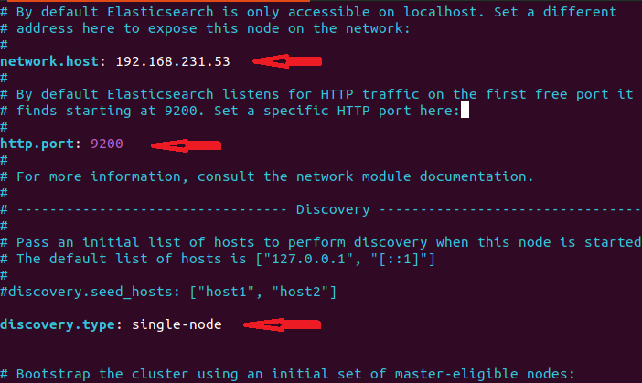
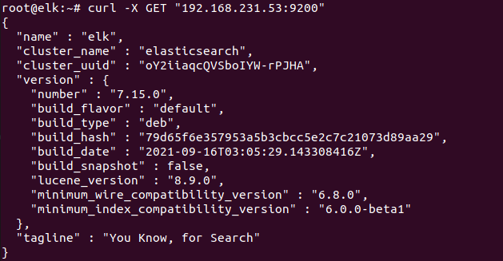
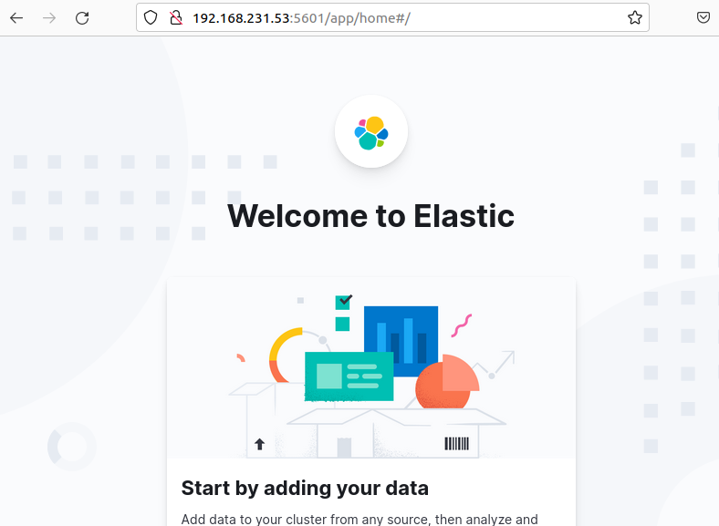
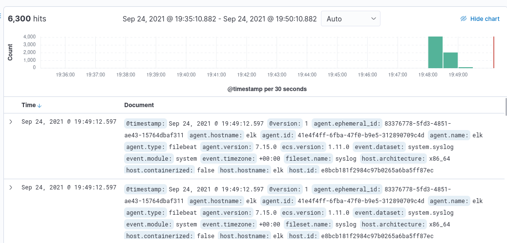

# ELK Stack là gì?

ELK Stack là tập hợp 3 phần mềm đi chung với nhau, phục vụ cho công việc logging. Ba phần mềm này lần lượt là:

- Elasticsearch: Cơ sở dữ liệu để lưu trữ log

- Logstash: Tiếp nhận log từ nhiều nguồn, sau đó xử lý log và ghi dữ liệu và Elasticsearch

- Kibana: Giao diện để quản lý, thống kê log. Đọc thông tin từ Elasticsearch

# Vai trò của Elasticsearch,Logstash và Kibana

Logstash sẽ thu phập các Log từ nhiều nguồn như server gửi UDP request chứa log tới URL của Logstash, hoặc từ filebeat và sau đó sử lý log đó như thêm thông tin thời gian, IP và ghi dữ liệu vào Elasticsearch

Elasticsearch sẽ có vai trò lưu trữ và tìm kiếm các query log mà logstash thu thập được

Kibana có vai trò là hiển thị giao diện để quản lý, thống kê log. Đọc thông tin từ Elasticsearch 

## Setup ELK

1. Chuẩn bị

- 1 ELK Server OS ubutu 20.4 IP 192.168.231.53

- 1 Client OS ubuntu 18.4 IP 192.168.231.52

1.1 Cài các gói cần thiết

    apt install openjdk-8-jdk -y
     
    apt install apt-transport-https

    wget -qO - https://artifacts.elastic.co/GPG-KEY-elasticsearch | sudo apt-key add -

1.2 Add Elastic repository vào repository list và update

    echo "deb https://artifacts.elastic.co/packages/7.x/apt stable main" | sudo tee –a /etc/apt/sources.list.d/elastic-7.x.list  

    apt update

2.Cài Elasticsearch

     apt install elasticsearch

2.1 Configure Elasticsearch

    vim /etc/elasticsearch/elasticsearch.yml

2.2 uncomment #network.host: 192.168.0.1 ,#http.port: 9200 và thêm discovery.type: single-node

    network.host: 192.168.231.53
    http.port: 9200
    discovery.type: single-node

2.3 Chỉnh sửa size với JVM  tối đa và tối thiểu trong file jvm.options

    vim /etc/elasticsearch/jvm.options

sửa maximum (-Xmx4g),minimum (-Xms4g) size là 512MB.

    -Xmx512m
    -Xms512m

2.4 Start Elasticsearch

    systemctl enable elasticsearch

    systemctl start elasticsearch

2.5 Kiểm tra Elasticsearch

    curl -X GET "192.168.231.53:9200"

3.Install Kibana

    apt install kibana

3.1 Configure Kibana

    vim /etc/kibana/kibana.yml

3.2 uncomment #server.port: 5601,#server.host: "localhost" và elasticsearch.hosts: ["http://localhost:9200"]

sửa thành 

    server.host: 192.168.231.53

    elasticsearch.hosts: ["http://192.168.231.53:9200"]

3.3 Start and Enable Kibana

    systemctl enable kibana

    systemctl start kibana

3.4 cho phép allow traffic on port 5601

    ufw allow 5601/tcp

3.5 Test Kibana

    http://192.168.231.53:5601

4.Install Logstash

     apt install logstash

4.1 Configure Logstash
 
 - 4.1.1 Tạo file system.conf 

       vim /etc/logstash/conf.d/system.conf

       input {
         beats {
          port => 5044
          }
         }

        output {
         elasticsearch {
          hosts => ["192.168.231.53:9200"]
          sniffing => true
          manage_template => false
          index => "%{[@metadata] [beat]}-%{+YYYY.MM.dd}"
          document_type => "%{[@metadata][type]}"
         }
        }

        filter {
        if [type] == "syslog" {
       grok {
        match => { "message" => "%{SYSLOGTIMESTAMP:syslog_timestamp} %{SYSLOGHOST:syslog_hostname} %{DATA:syslog_program}(?:\[%{POSINT:syslog_pid}\])?: %{GREEDYDATA:syslog_message}" }
        add_field => [ "received_at", "%{@timestamp}" ]
        add_field => [ "received_from", "%{host}" ]
       }
       syslog_pri { }
       date {
        match => [ "syslog_timestamp", "MMM  d HH:mm:ss", "MMM dd HH:mm:ss" ]
         }
        }
       }

4.2 Enable,Start and status Logstash

    systemctl enable logstash

    systemctl start logstash

    systemctl status logstash

    sudo ufw allow 5044

# Setup filebeat lên client

5.Install Filebeat

     curl -L -O https://artifacts.elastic.co/downloads/beats/filebeat/filebeat-7.15.0-amd64.deb

    sudo dpkg -i filebeat-7.15.0-amd64.deb

5.1 Configure Filebeat

    vim /etc/filebeat/filebeat.yml

5.1.1 comment 

    # output.elasticsearch:
      # Array of hosts to connect to.
      # hosts: ["localhost:9200"]

5.1.2 ucomment

    output.logstash
       hosts: ["192.168.231.53:5044"]

5.2 Enable the Filebeat system module

    sudo filebeat modules enable system

5.3 index template

    sudo filebeat setup --index-management -E output.logstash.enabled=false -E 'output.elasticsearch.hosts=["192.168.231.53:9200"]'

5.4 Start and Enable Filebeat

    systemctl enable filebeat

    systemctl start filebeat

5.5 Verify Elasticsearch Reception of Data

    curl -XGET http://192.168.231.53:9200/_cat/indices?v

5.6 Kết quả

    

