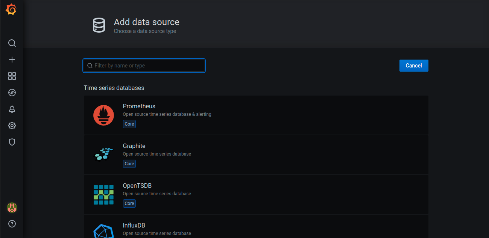
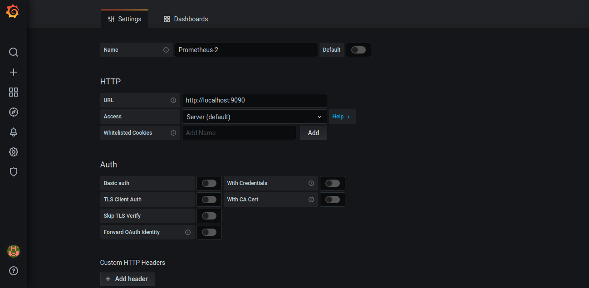
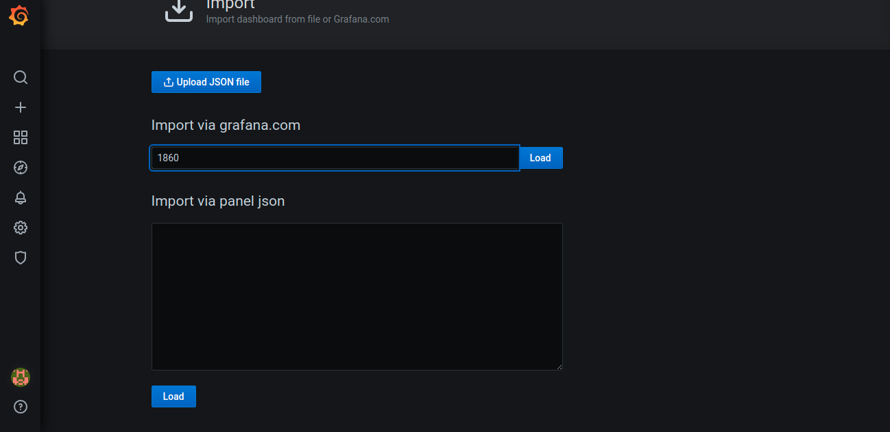
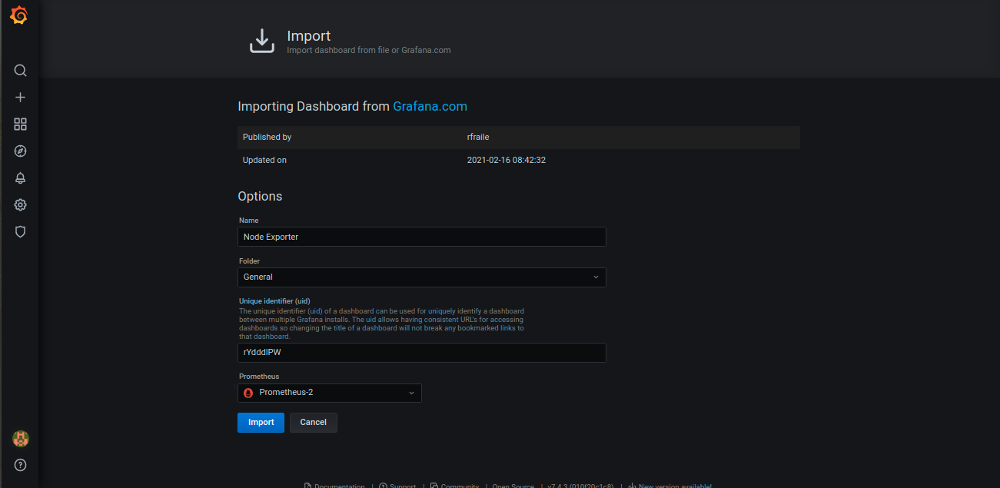
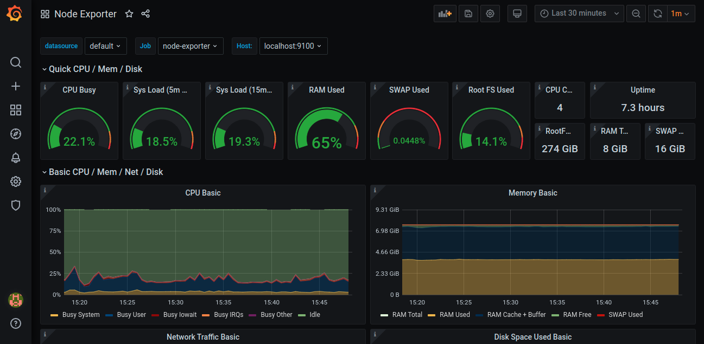

# 1 Cài đặt một số gói cần thiết 

```
yum install wget -y
```

# 2 Tạo một user cho service prometheus

```
useradd --no-create-home --shell /bin/false prometheus
```

# 3 Tạo và phân quyền thư mục 

```
mkdir /etc/prometheus
mkdir /var/lib/prometheus
chown prometheus:prometheus /etc/prometheus
chown prometheus:prometheus /var/lib/prometheus
```

# 4 Tải source code prometheus

```
cd /opt
wget https://github.com/prometheus/prometheus/releases/download/v2.27.1/prometheus-2.27.1.linux-amd64.tar.gz -O prometheus.tar.gz
tar xvf prometheus.tar.gz 
mv prometheus-2.27.1.linux-amd64 prometheus

cp prometheus/prometheus /usr/local/bin/
cp prometheus/promtool /usr/local/bin/

chown prometheus:prometheus /usr/local/bin/prometheus
chown prometheus:prometheus /usr/local/bin/promtool

cp -r prometheus/consoles /etc/prometheus
cp -r prometheus/console_libraries /etc/prometheus

chown -R prometheus:prometheus /etc/prometheus/consoles
chown -R prometheus:prometheus /etc/prometheus/console_libraries

```

# 5 Tạo một file cấu hình để tự scrape metric của chính prometheus server

```
cat <<EOF > /etc/prometheus/prometheus.yml
global:
  scrape_interval: 15s

scrape_configs:
  - job_name: 'prometheus'
    scrape_interval: 5s
    static_configs:
      - targets: ['localhost:9090']
EOF
```

# 6 Tạo file systemd

```
cat <<EOF > /etc/systemd/system/prometheus.service
[Unit]
Description=Prometheus
Wants=network-online.target
After=network-online.target

[Service]
User=prometheus
Group=prometheus
Type=simple
ExecStart=/usr/local/bin/prometheus \
    --config.file /etc/prometheus/prometheus.yml \
    --storage.tsdb.path /var/lib/prometheus/ \
    --web.console.templates=/etc/prometheus/consoles \
    --web.console.libraries=/etc/prometheus/console_libraries

[Install]
WantedBy=multi-user.target
EOF
```

# 7  Khởi động Prometheus sever

```
systemctl daemon-reload
systemctl start prometheus
systemctl status prometheus
systemctl enable prometheus
```
# 8 kiểm tra Prometheus sever

```
http://localhost:9090/graph

http://localhost:9090/metrics
```

# Cài đặt grafana

# 1 Tạo repo Grafana

```
vim /etc/yum.repos.d/grafana.repo

[grafana]
name=grafana
baseurl=https://packages.grafana.com/oss/rpm
repo_gpgcheck=1
enabled=1
gpgcheck=1
gpgkey=https://packages.grafana.com/gpg.key
sslverify=1
sslcacert=/etc/pki/tls/certs/ca-bundle.crt
```
# 2 Cài đặt Grafana

```
yum install grafana -y
```

# 3 Khởi động dịch vụ grafana

```
systemctl daemon-reload
systemctl start grafana-server
systemctl enable grafana-server
systemctl status grafana-server
```
# 4 Setup grafana

Sau khi đăng nhập vào grafana password mặc định là admin/admin Chọn Add data source để thêm Prometheus






Sau khi chọn data source thì chúng sẽ điền thông tin URL của grafana vào và chọn save & test


Khi data source hoạt động thì chúng ta chỉ cần cài đặt dashboard để hiển các thông số

Clich vào setting chọn Import



Sau khi chúng load dashboard lên thì chúng ta cần chọn data source cho dashboard đấy.



Và đây là kết quả




# Cài đặt prometheus trên node

# 1 Tạo user cho prometheus

```
useradd --no-create-home --shell /bin/false node_exporter
```
# 2 Tải source code

```
cd /opt
wget https://github.com/prometheus/node_exporter/releases/download/v0.18.1/node_exporter-0.18.1.linux-amd64.tar.gz

tar xvf node_exporter-0.18.1.linux-amd64.tar.gz

cp node_exporter-0.18.1.linux-amd64/node_exporter /usr/local/bin
chown node_exporter:node_exporter /usr/local/bin/node_exporter
```

# 3  Chạy exporter dưới systemd

```
cat <<EOF >  /etc/systemd/system/node_exporter.service
[Unit]
Description=Node Exporter
Wants=network-online.target
After=network-online.target

[Service]
User=node_exporter
Group=node_exporter
Type=simple
ExecStart=/usr/local/bin/node_exporter

[Install]
WantedBy=multi-user.target
EOF
```
# 4 Khởi động lại service

```
systemctl daemon-reload
systemctl start node_exporter
systemctl enable node_exporter
```
# 5 kiểm tra metric thu thập được trên node

```
http://192.168.115.134:9100/metrics

```
# 6 thêm node vào prometheus sever

```
vim /etc/prometheus/prometheus.yml

global:
  scrape_interval: 15s

scrape_configs:
  - job_name: 'prometheus'
    scrape_interval: 5s
    static_configs:
      - targets: ['localhost:9090']
  - job_name: 'node_1'
    scrape_interval: 5s
    static_configs:
      - targets: ['192.168.115.134:9100']
```

# 7 Khởi động lại service:

```
systemctl restart prometheus
```

Truy cập http://192.168.115.133:9090/graph để thực hiện query metrics

```
{instance="192.168.115.134:9100" , job=node_1"}
```


